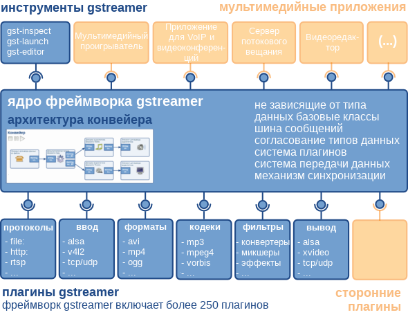

# Фреймворк GStreamer. Руководство разработчика приложений. Обзор фреймворка GStreamer [h1-what-is-gstreamer]

Оригинал: GStreamer Application Development Manual  
Авторы: Wim Taymans, Steve Baker, Andy Wingo, Ronald S. Bultje, Stefan Kost  
Дата публикации: 21 мая 2014 г.  
Перевод: А.Панин  
Дата перевода: 18 июня 2014 г.  
Оригинал: [Фреймворк GStreamer. Руководство разработчика приложений. Обзор фреймворка GStreamer](http://rus-linux.net/MyLDP/BOOKS/gstreamer/01-gstreamer.html)

## Часть I. О фреймворке GStreamer [about-gstreamer]

Данная часть содержит обзор технологий, описываемых руководстве.

## Глава 1. Обзор фреймворка GStreamer [what-is-gstreamer]

GStreamer является фреймворком для создания приложений, обрабатывающих потоковые мультимедийные данные. Фундаментальное архитектурное решение, примененное в GStreamer, было создано на основе архитектуры конвейера для обработки видео, созданного в Oregon Graduate Institute, а также некоторых идей, взятых из подсистемы DirectShow.

Инструменты для разработки приложений из состава фреймворка GStreamer позволяют создавать приложения для обработки потоковых мультимедийных данных любого типа. Фреймворк GStreamer спроектирован таким образом, чтобы упростить разработку приложений, обрабатывающих потоки аудиоданных, видеоданных или потоки с аудио- и видеоданными. Он не ограничивает свои функции обработкой аудио- и видеоданных и может обрабатывать потоки данных любого типа. Архитектура конвейера разработана таким образом, что снижение производительности из-за использования конвейера не является существенным по сравнению со снижением производительности из-за использования фильтров. Это обстоятельство позволяет использовать фреймворк GStreamer даже при создании сложных приложений для обработки аудиоданных, которые предъявляют высокие требования к задержкам.

Одним из наиболее очевидных вариантов использования фреймворка GStreamer является создание на его основе мультимедийных проигрывателей. Фреймворк GStreamer уже содержит компоненты для создания мультимедийного проигрывателя с поддержкой широкого спектра форматов, включая MP3, Ogg/Vorbis, MPEG-1/2, AVI, Quicktime, mod и другие. Однако, фреймворк GStreamer позволяет решать гораздо более сложные задачи, чем создание еще одного мультимедийного проигрывателя. Его основными достоинствами являются подключаемые компоненты, которые могут связываться для формирования произвольных конвейеров, что дает возможность разрабатывать на его основе полнофункциональное приложение для редактирования потоков аудио- или видеоданных.

Фреймворк основан на плагинах, в рамках которых реализуются функции различных кодеков, а также дополнительные функции. Плагины могут связываться и размещаться в рамках конвейера. Конвейер устанавливает направление потока данных. Структура конвейера также может редактироваться с помощью приложения с графическим интерфейсом и сохраняться в файле формата XML, поэтому трудозатраты, связанные с созданием библиотек для работы с конвейером, могут сводиться к минимуму.

Основной функцией ядра фреймворка GStreamer является реализация фреймворка для плагинов, потоковой передачи данных и обработки мультимедийных потоков с согласованием используемых типов мультимедийных данных. Оно также предоставляет API для разработки приложений, использующих различные плагины.

В частности, фреймворк GStreamer предоставляет:

- API для мультимедийных приложений
- Архитектуру, использующую плагины
- Архитектуру, использующую конвейер
- Механизм обработки мультимедийных потоков с согласованием использования типов мультимедийных данных
- Механизм для синхронизации
- Более 250 плагинов, предоставляющих более 1000 элементов
- Набор дополнительных инструментов

Плагины фреймворка GStreamer могут быть разделены на:

- Плагины для работы с протоколами
- Плагины для работы с источниками данных: для аудио- и видеоданных (включают плагины для работы с протоколами)
- Плагины для работы с форматами: для разбора, изменения формата, мультиплексирования, демультиплексирования, обработки метаданных, обработки субтитров
- Плагины с реализациями кодеков: для кодирования и декодирования данных
- Плагины фильтров: для создания конвертеров, микшеров, эффектов, ...
- Плагины для вывода данных: для вывода аудио- и видеоданных (включают плагины протоколов)

Различные компоненты фреймворка GStreamer упакованы в следующие пакеты:

- gstreamer: основной пакет
- gst-plugins-base: стандартный набор основных элементов
- gst-plugins-good: набор высококачественных плагинов, распространяемых в соответствии с условиями лицензии LGPL
- gst-plugins-ugly: набор высококачественных плагинов, распространение которых может быть связано с проблемами
- gst-plugins-bad: набор плагинов, качество которых должно быть повышено
- gst-libav: набор плагинов, являющихся обертками для библиотеки libav и предназначенных для декодирования и кодирования мультимедийных данных
- некоторые другие пакеты

----------

Предыдущий раздел : [Обзор фреймворка GStreamer](00-pred.html).

Следующий раздел : [Принципы проектирования фреймворка](02-motivation.html).

Главная страница : [http://neon1ks.github.io/](../index.html)
