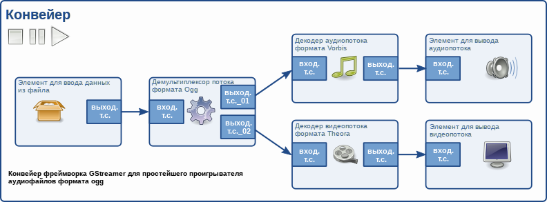
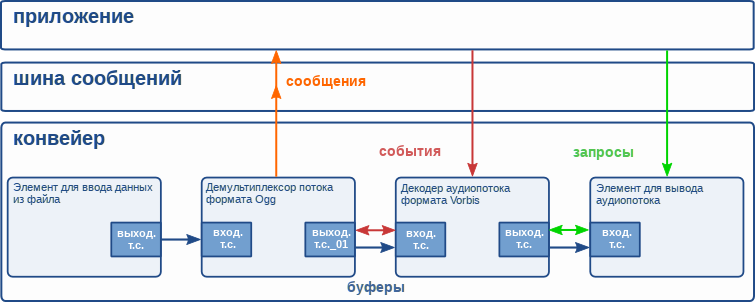

# Фреймворк GStreamer. Руководство разработчика приложений. Основные концепции [h1-foundations]

Оригинал: GStreamer Application Development Manual  
Авторы: Wim Taymans, Steve Baker, Andy Wingo, Ronald S. Bultje, Stefan Kost  
Дата публикации: 21 мая 2014 г.  
Перевод: А.Панин  
Дата перевода: 18 июня 2014 г.  
Оригинал перевода: [Фреймворк GStreamer. Руководство разработчика приложений. Основные концепции](http://rus-linux.net/MyLDP/BOOKS/gstreamer/03-intro-basics.html)

## Глава 3. Основные концепции [foundations]

В данном разделе руководства описаны базовые концепции фреймворка GStreamer. Понимание этих концепций окажется очень важным при чтении оставшейся части руководства, ведь при создании каждой из глав предполагалось, что вы уже знакомы с ними.

## 3.1. Элементы [elements]

Элемент (*element*) является наиболее важным классом объектов фреймворка GStreamer. Обычно вы будете создавать цепочку из связанных друг с другом элементов и передавать данные через эту цепочку из элементов. Элемент должен выполнять одну определенную функцию, которая может заключаться в чтении данных из файла, декодировании этих данных или выводе этих данных с помощью вашей аудиокарты (или любого другого устройства). Создавая цепочку из нескольких таких элементов, вы создаете конвейер, который может выполнять определенную задачу, например, проигрывать потоки мультимедийных данных или захватывать их. В комплекте поставки фреймворка GStreamer присутствует обширная коллекция стандартных элементов, позволяющая разрабатывать большое количество отличающихся по функциям мультимедийных приложений. При необходимости вы также можете разрабатывать новые элементы. Эта тема достаточно подробно раскрыта в Руководстве разработчика плагинов фреймворка GStreamer под названием "*GStreamer Plugin Writer's Guide*".

## 3.2. Точки соединения [pads]

Точки соединения (*pads*) являются вводами и выводами потоков данных для элемента, с помощью которых вы можете соединить элемент с другими элементами. Они используются для осуществления манипуляций с соединениями и потоками данных между элементами фреймворка GStreamer. Точка соединения может рассматриваться как "коннектор" или "порт" элемента, с помощью которого может устанавливаться соединение с другими элементами и посредством которого данные могут передаваться от этих элементов или этим элементам. Точки соединения обладают специфичными возможностям обработки данных: точка соединения может установить ограничение для типа данных, которые будут передаваться через нее. Связь двух точек соединения может устанавливаться только в том случае, если установленные типы данных для двух точек соединения являются совместимыми. Ограничения типов данных для точек соединения устанавливаются в ходе процесса под названием "согласование возможностей" (*"caps negotiation"*). Типы данных описываются с помощью объектов возможностей типа `GstCaps`.

В данном случае аналогия может оказаться полезной. Точка соединения аналогична разъему или штекеру физического устройства. Представьте, например, систему домашнего кинотеатра, состоящую из усилителя, проигрывателя DVD и видеопроектора (не выводящего звук). Соединение проигрывателя DVD с усилителем возможно, так как оба устройства имеют разъемы для подключения кабеля, предназначенного для передачи звука, при этом соединение проектора с проигрывателем DVD также возможно, так как оба устройства имеют разъемы для подключения кабеля, предназначенного для передачи видео. Соединения между проектором и усилителем не могут осуществляться из-за того, что проектор и усилитель имеют разные типы разъемов. Точки соединения фреймворка GStreamer используются для тех же целей, что и разъемы в системе домашнего кинотеатра.

В большинстве случаев, все данные в раках фреймворка GStreamer передаются единственным способом посредством связей между элементами. Данные выводятся элементом посредством одной или нескольких выходных точек соединения (source pads) и принимаются элементами посредством одной или нескольких входных точек соединения (sink pads). Элементы для ввода и вывода данных имеют только выходные и входные точки соединения соответственно. При разговоре о данных обычно имеются в виду буферы (реализованные в рамках объектов типа [GstBuffer](http://gstreamer.freedesktop.org/data/doc/gstreamer/stable/gstreamer/html/gstreamer-GstBuffer.html)) и события (реализованные в рамках объектов типа [GstEvent](http://gstreamer.freedesktop.org/data/doc/gstreamer/stable/gstreamer/html/gstreamer-GstEvent.html)).

## 3.3. Контейнеры и конвейеры [bins-and-pipelines]

Контейнер (*bin*) предназначен для хранения коллекции элементов. Так как контейнеры являются подклассами классов самих элементов, вы в большинстве случаев можете работать с контейнером точно так же, как и с элементом, абстрагируясь таким образом от большого количества сложностей при разработке приложения. Например, вы можете изменить состояние всех элементов контейнера, изменив состояние самого контейнера. Контейнеры также передают широковещательные сообщения от своих дочерних элементов (такие, как сообщения об ошибках, сообщения о тэгах или сообщения об окончании потока).

Конвейер (*pipeline*) является высокоуровневым контейнером. Он предоставляет шину сообщений для приложения и осуществляет синхронизацию состояния своих дочерних элементов. При изменении его состояния на "пауза" (PAUSED) или "проигрывается" (PLAYING) начнется передача данных и обработка мультимедийных потоков. После запуска контейнеры будут работать в отдельном потоке до того момента, когда вы остановите их или будет достигнут конец потока данных.

## 3.4. Взаимодействия [communication]

Фреймворк GStreamer предоставляет несколько механизмов для взаимодействия и осуществления обмена данными между *приложением* и *конвейером*.

- Буферы (*buffers*) являются объектами для передачи потоков данных между элементами в рамках конвейера. Буферы всегда всегда передаются от выходных точек соединения к входным точкам соединения (по направлению конвейера).

- События (*events*) являются объектами, которые передаются между элементами или от приложения к элементам. События могут передаваться как против направления, так и по направлению конвейера. События, передающиеся по направлению конвейера, могут быть синхронизированы с потоком данных.

- Сообщения (*messages*) являются объектами, передающимися элементами посредством шины сообщений конвейера, благодаря которой они накапливаются для последующей обработки приложением. Сообщения могут быть синхронно перехвачены из контекста программного потока элемента, отправившего сообщение, но обычно они обрабатываются асинхронно приложением в его главном программном потоке. Сообщения используются для потокобезопасной передачи такой информации, как информация об ошибках, тэгах, изменениях состояния, состоянии буферизации, перенаправлениях и т. д. от элементов к приложению.

- Запросы (*queries*) позволяют приложениям запрашивать у объекта конвейера такую информацию, как информация о длительности потока или о текущей позиции в потоке при его проигрывании. Ответы на запросы всегда отправляются синхронно. Элементы также могут использовать запросы для получения информации от элементов, предоставляющих им данные (такой, как размер файла или продолжительность потока). Они могут отправляться по обоим направлениями, но запросы, отправляемые против направления конвейера, встречаются более часто.

----------

Предыдущий раздел : [Принципы проектирования фреймворка](02-motivation.html).

Следующий раздел : [Инициализация библиотеки фреймворка GStreamer](04-init.html).

Главная страница : [http://neon1ks.github.io/](../index.html)
