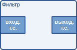
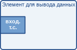

# Фреймворк GStreamer. Руководство разработчика приложений. Элементы [h1-elements]

Оригинал: GStreamer Application Development Manual  
Авторы: Wim Taymans, Steve Baker, Andy Wingo, Ronald S. Bultje, Stefan Kost  
Дата публикации: 21 мая 2014 г.  
Перевод: А.Панин  
Дата перевода: 18 июня 2014 г.  
Оригинал перевода: [Фреймворк GStreamer. Руководство разработчика приложений. Элементы](http://rus-linux.net/MyLDP/BOOKS/gstreamer/05-elements.html)


## Глава 5. Элементы [elements]

Наиболее важным для разработчика приложений объектом фреймворка GStreamer является объект элемента типа [GstElement](http://gstreamer.freedesktop.org/data/doc/gstreamer/stable/gstreamer/html/GstElement.html). Элемент является базовым строительным блоком для конвейера, предназначенного для обработки мультимедийных потоков. Классы всех тех различных высокоуровневых компонентов, которые вы будете использовать, унаследованы от класса `GstElement`. Каждый декодер, кодировщик, демультиплексор, элемент вывода аудио- и видеоданных фактически является экземпляром класса `GstElement`.

### 5.1. Чем являются элементы? [what-are-elements]

Для разработчика приложений лучшей иллюстрацией элементов являются черные ящики. С одной стороны вы помещаете в них какие-либо данные, элемент обрабатывает эти данные каким-либо способом, после чего с другой стороны выводятся какие-либо другие данные. Для элемента декодера, например, вы могли бы поместить закодированные данные, а элемент вывел бы декодированные данные. В следующем разделе (["Точки соединения и возможности"](http://gstreamer.freedesktop.org/data/doc/gstreamer/head/manual/html/chapter-pads.html)) вы узнаете больше о передаче и получении данных от элементов, а также о том, как вы можете осуществить настройку элементов вашего приложения.

#### 5.1.1. Элементы для ввода данных [source-elements]

Элементы для ввода данных генерируют данные для последующей обработки в рамках конвейера, к примеру, читая их с диска или из буфера аудиокарты. На Рисунке 5.1. "Изображение элемента для ввода данных" показано изображение, которое мы будем использовать для обозначения элемента для ввода данных. Мы всегда изображаем выходную точку соединения в правой части элемента.


Элементы для ввода данных не принимают, а только генерируют данные. Вы можете увидеть это на рисунке, так как на нем изображена только выходная точка соединения (в правой части). Выходная точка соединения может исключительно передавать сгенерированные данные.

#### 5.1.2. Фильтры, конвертеры, демультиплексоры, мультиплексоры и кодеки [filters-convertors-demuxers-muxers-and-codecs]

Фильтры и подобные фильтрам элементы имеют как входные, так и выходные точки соединения. Они работают с данными, которые принимают с помощью входных точек соединения и впоследствии передают данные с помощью выходных точек соединения. Примерами таких элементов являются элементы изменения уровня звука (фильтры), элементы масштабирования изображения (конвертеры), демультиплексоры формата Ogg или декодеры формата Vorbis.

Подобные фильтрам элементы могут иметь произвольное количество входных и выходных точек соединения. Демультиплексор видеопотоков, например, будет иметь одну входную точку соединения и несколько (1-N) выходных точек соединения, по одной для каждого элементарного потока, содержащегося в контейнерном потоке. Декодеры, с другой стороны, будут иметь только по одной входной и выходной точке соединения.



На Рисунке 5.2. "Изображение элемента фильтра" показано изображение подобного фильтру элемента, которое мы будем использовать. Элемент этого типа имеет одну входную и одну выходную точку соединения. С помощью входной точки соединения, изображенной слева, осуществляется прием входных данных; а выходные точки соединения все так же изображаются справа.


На Рисунке 5.3. "Изображение элемента фильтра с более чем одной выходной точкой соединения" показан другой подобный фильтру элемент, имеющий более одной выходной точки соединения. Примером такого элемента может быть демультиплексор формата Ogg для потока данных в формате Ogg, содержащего как видеопоток, так и аудиопоток. Одна выходная точка соединения будет содержать элементарный видеопоток, а вторая - элементарный аудиопоток. Демультиплексоры в общем случае будут генерировать сигналы при создании новой точки соединения. Благодаря этому разработчик приложения сможет осуществить обработку нового элементарного потока в рамках обработчика сигналов. 

#### 5.1.3. Элементы для вывода данных [sink-elements]

Элементы для вывода данных являются конечными точками в конвейере для обработки мультимедийных потоков. Они принимают данные, но не передают ничего. С помощью элементов для вывода данных могут быть реализованы функции записи мультимедийных потоков на диск, вывода звука с помощью аудиокарты, а также вывода видео. На Рисунке 5.4. "Изображение элемента для вывода данных" показан элемент для вывода данных.



### 5.2. Создание экземпляра класса GstElement [creating-a-gstelement]

Простейший способ создания элемента заключается в использовании функции [`gst_element_factory_make()`](http://gstreamer.freedesktop.org/data/doc/gstreamer/stable/gstreamer/html/GstElementFactory.html#gst-element-factory-make). Эта функция принимает в качестве аргументов имя фабрики и имя создаваемого элемента. Имя элемента является произвольным идентификатором, который вы сможете использовать позднее, например, для поиска элемента в контейнере. Это имя также будет использоваться в выводимых отладочных сообщениях. Вы можете передать значение `NULL` в качестве значения аргумента имени для получения уникального стандартного имени элемента.

В момент, когда элемент перестанет быть нужным, вы должны будете удалить ссылку на него с помощью функции [`gst_object_unref()`](http://gstreamer.freedesktop.org/data/doc/gstreamer/stable/gstreamer/html/GstObject.html#gst-object-unref). Данная функция уменьшает значение счетчика ссылок элемента на 1. Значение счетчика ссылок элемента при создании равно 1. Элемент полностью уничтожается в момент, когда значение счетчика ссылок снижается до 0.

Следующий пример[^1] иллюстрирует методику создания элемента с именем `source` с помощью фабрики элементов с именем `fakesrc`. В нем осуществляется проверка успешности создания элемента. После проверки единственная ссылка на созданный элемент удаляется.

```
#include <gst/gst.h>

int
main (int   argc,
      char *argv[])
{
  GstElement *element;

  /* Инициализация библиотеки фреймворка GStreamer */
  gst_init (&argc, &argv);

  /* Создание элемента */
  element = gst_element_factory_make ("fakesrc", "source");
  if (!element) {
    g_print ("Не удалось создать элемент типа 'fakesrc'\n");
    return -1;
  }

  gst_object_unref (GST_OBJECT (element));

  return 0;
}
```

Функция `gst_element_factory_make()` на самом деле является оберткой для комбинации из двух функций. Объект типа [`GstElement`](http://gstreamer.freedesktop.org/data/doc/gstreamer/stable/gstreamer/html/GstElement.html) создается с помощью фабрики элементов. Для создания элемента вам необходимо получить доступ к объекту фабрики элементов типа [`GstElementFactory`](http://gstreamer.freedesktop.org/data/doc/gstreamer/stable/gstreamer/html/GstElementFactory.html) с использованием уникального имени фабрики. Эта задача решается с помощью функции [`gst_element_factory_find()`](http://gstreamer.freedesktop.org/data/doc/gstreamer/stable/gstreamer/html/GstElementFactory.html#gst-element-factory-find).

Следующий фрагмент кода используется для получения фабрики, которая может быть использована для создания элемента типа `fakesrc`, являющегося элементом для фиктивного ввода данных. Функция [`gst_element_factory_create()`](http://gstreamer.freedesktop.org/data/doc/gstreamer/stable/gstreamer/html/GstElementFactory.html#gst-element-factory-create) будет использовать фабрику элементов для создания элемента с заданным именем.

```
#include <gst/gst.h>

int
main (int   argc,
      char *argv[])
{
  GstElementFactory *factory;
  GstElement * element;

  /* Инициализация библиотеки фреймворка GStreamer */
  gst_init (&argc, &argv);

  /* Создание элемента, метод #2 */
  factory = gst_element_factory_find ("fakesrc");
  if (!factory) {
    g_print ("Не удалось найти фабрику типа 'fakesrc'\n");
    return -1;
  }
  element = gst_element_factory_create (factory, "source");
  if (!element) {
    g_print ("Не удалось создать элемент, учитывая то, что соответствующая фабрика уже существует!\n");
    return -1;
  }

  gst_object_unref (GST_OBJECT (element));

  return 0;
}
```

### 5.3. Использование элемента как объекта типа GObject [using-an-element-as-a-gobject]

Элемент типа [`GstElement`](http://gstreamer.freedesktop.org/data/doc/gstreamer/stable/gstreamer/html/GstElement.html) может иметь несколько свойств, которые реализованы на основе стандартных свойств объектной модели `GObject`. Следовательно, будут поддерживаться обычные методы объектной модели `GObject` для запроса, установки и получения значений свойств, а также для работы с метаданными параметров объектов типа `GParamSpec`.

Каждый элемент типа `GstElement` наследует как минимум одно свойство от своего родителя типа `GstObject`: свойство "name". Это свойство представляет имя, которое вы передавали функции `gst_element_factory_make()` или `gst_element_factory_create()`. Вы можете получить и установить значение данного свойства с помощью функций `gst_object_set_name()` и `gst_object_get_name()` или использовать механизм свойств объектной модели `GObject` таким же образом, как показано ниже.

```
#include <gst/gst.h>

int
main (int   argc,
      char *argv[])
{
  GstElement *element;
  gchar *name;

  /* Инициализация библиотеки фреймворка GStreamer */
  gst_init (&argc, &argv);

  /* Создание элемента */
  element = gst_element_factory_make ("fakesrc", "source");

  /* Получение имени элемента */
  g_object_get (G_OBJECT (element), "name", &name, NULL);
  g_print ("Имя элемента: '%s'.\n", name);
  g_free (name);

  gst_object_unref (GST_OBJECT (element));

  return 0;
}
```

Большинство плагинов предоставляет дополнительные свойства для передачи большего объема информации о своей конфигурации или для непосредственного выполнения конфигурации элемента. Утилита **gst-inspect** является полезным инструментом, предназначенным для получения значений свойств определенного элемента, причем она также выполняет исследование выбранного свойства для предоставления краткого описания его назначения, типов параметров и диапазона поддерживаемых значений. Обратитесь [разделу "gst-inspect"](http://gstreamer.freedesktop.org/data/doc/gstreamer/head/manual/html/section-checklist-applications.html#section-applications-inspect) из приложений для ознакомления с подробным описанием возможностей утилиты **gst-inspect**.

Для получения дополнительной информации о свойствах в рамках объектной модели `GObject` мы рекомендуем вам ознакомиться с со следующими документами: ["Руководство по работе с объектной моделью GObject"](http://developer.gnome.org/gobject/stable/rn01.html) и ["Введение в систему объектов библиотеки Glib"](http://developer.gnome.org/gobject/stable/pt01.html).

Элемент типа [`GstElement`](http://gstreamer.freedesktop.org/data/doc/gstreamer/stable/gstreamer/html/GstElement.html) также предоставляет различные сигналы объектной модели `GObject`, которые могут использоваться в качестве гибкого механизма для работы с функциями обратного вызова. Здесь вы также можете прибегнуть к использованию утилиты **gst-inspect** для ознакомления с тем, какие сигналы определенный элемент поддерживает. Комбинация сигналов и свойств является простейшим механизмом взаимодействия элементов и приложений.

### 5.4. Подробнее о фабриках элементов [more-about-element-factories]

В предыдущем разделе мы кратко описали объект типа [`GstElementFactory`](http://gstreamer.freedesktop.org/data/doc/gstreamer/stable/gstreamer/html/GstElementFactory.html) как объект, позволяющий создавать экземпляры классов элементов. Фабрики элементов, однако, могут выполнять гораздо больше функций. Фабрики элементов являются базовыми типами, получаемыми из реестра фреймворка GStreamer, поэтому они описывают все плагины и элементы, которые могут создаваться средствами фреймворка GStreamer. Это значит, что фабрики элементов полезны для автоматизированного создания объектов элементов таким образом, как это делается в реализациях элементов для автоматического подключения плагинов, а также для создания списков доступных элементов.

#### 5.4.1. Получение информации об элементе с помощью фабрики [getting-information-about-an-element-using-a-factory]

Такие инструменты, как **gst-inspect** могут выводить некоторый объем такой обобщенной информации об элементе, как имя разработчика, полное (и короткое) название, класс и категория соответствующего плагина. Категория может использоваться для получения типа элемента, который может быть создан с помощью данной фабрики элементов. Примерами категорий являются `Codec/Decoder/Video` (декодер видеопотоков), `Codec/Encoder/Video` (кодировщик видеопотоков), `Source/Video` (генератор видеопотоков), `Sink/Video` (вывод видеопотоков) и, разумеется, все эти категории также применимы и к аудиопотокам. Также существуют категории демультиплексоров `Codec/Demux` и мультиплексоров `Codec/Muxer` наряду с множеством других категорий. Утилита **gst-inspect** при необходимости выведет список всех фабрик, а команда **gst-inspect <имя фабрики>** выведет всю описанную выше информацию, а также множество дополнительных сведений о фабрике.

```
#include <gst/gst.h>

int
main (int   argc,
      char *argv[])
{
  GstElementFactory *factory;

  /* Инициализация библиотеки фреймворка GStreamer */
  gst_init (&argc, &argv);

  /* Получение объекта фабрики */
  factory = gst_element_factory_find ("fakesrc");
  if (!factory) {
    g_print ("У вас не установлен модуль для создания элемента типа 'fakesrc'!\n");
    return -1;
  }

  /* Вывод информации */
  g_print ("Элемент '%s' относится к категории %s.\n"
           "Описание: %s\n",
           gst_plugin_feature_get_name (GST_PLUGIN_FEATURE (factory)),
           gst_element_factory_get_metadata (factory, GST_ELEMENT_METADATA_KLASS),
           gst_element_factory_get_metadata (factory, GST_ELEMENT_METADATA_DESCRIPTION));

  return 0;
}
```

#### 5.4.2 Получения списка фабрик элементов [get-list-element-factory]

Ранее была функция `gst_registry_pool_feature_list (GST_TYPE_ELEMENT_FACTORY)` для получения списка всех фабрик элементов, о которых известно фреймворку GStreamer. Но эту функцию убрали из кода.

Сейчас для получения списка фабрик элементов используется функция  [`gst_element_factory_list_get_elements ()`](https://developer.gnome.org/gstreamer/stable/GstElementFactory.html#gst-element-factory-list-get-elements)  возвращающая [`GList`](https://developer.gnome.org/glib/unstable/glib-Doubly-Linked-Lists.html#GList) со списком элементов [`GstElementFactory`](https://developer.gnome.org/gstreamer/stable/GstElementFactory.html).

```
GList *
gst_element_factory_list_get_elements (GstElementFactoryListType type,
                                       GstRank minrank);
```

В качестве первого аргумента функции передается тип фабрики элементов. Все типы перечислены на странице [GstElementFactory: GStreamer 1.0 Core Reference Manual](https://gstreamer.freedesktop.org/data/doc/gstreamer/head/gstreamer/html/GstElementFactory.html) в разделе *Types and Values*. Например, есть макрос `GST_ELEMENT_FACTORY_TYPE_ANY` соответствующий любому типу.

Второй аргумент функции ранг фабрики элементов: [`GstRank`](https://developer.gnome.org/gstreamer/stable/GstPluginFeature.html#GstRank). Для указания ранга имеется 4 макроса:

- `GST_RANK_NONE` &mdash; will be chosen last or not at all
- `GST_RANK_MARGINAL` &mdash; unlikely to be chosen
- `GST_RANK_SECONDARY` &mdash; likely to be chosen
- `GST_RANK_PRIMARY` &mdash; will be chosen first

Пример использования:

```
GList *elements = gst_element_factory_list_get_elements(GST_ELEMENT_FACTORY_TYPE_ANY,
                                                        GST_RANK_NONE);
GstElementFactory *elementFact;
for (l = elements; l != NULL; l = l->next) {
    elementFact = (GstElementFactory *)(l->data);

    // Первый способ получения имени
    g_print("factory: %s\n", GST_OBJECT_NAME(elementFact));

    printf("Элемент '%s' относится к категории %s.\n"
           "Описание: %s\n\n",
           gst_plugin_feature_get_name(GST_PLUGIN_FEATURE(elementFact)),
           gst_element_factory_get_metadata(elementFact, GST_ELEMENT_METADATA_KLASS),
           gst_element_factory_get_metadata(elementFact, GST_ELEMENT_METADATA_DESCRIPTION));
}

gst_plugin_feature_list_free(elements);
```


#### 5.4.3. Установление точек соединения, поддерживаемых элементом [finding-out-what-pads-an-element-can-contain]

Возможно, наиболее мощной возможностью фабрик элементов является хранение полных описаний точек соединения, которые элемент из плагина может генерировать, а также информации о возможностях этих точек соединения (говоря проще: информации о том, какие типы мультимедийных потоков могут передаваться через эти точки соединения) без необходимости непосредственной загрузки соответствующих плагинов в память. Эта информация может использоваться для формирования списка, предназначенного для выбора кодировщиков, или для реализации механизмов автоматического подключения плагинов мультимедийных проигрывателей. Все существующие мультимедийные проигрыватели на основе фреймворка GStreamer и элементы с поддержкой механизма автоматической подгрузки плагинов работают описанным образом. Мы рассмотрим эти возможности более подробно по мере рассмотрения объектов типов GstPad и GstCaps в следующем разделе: ["Точки соединения и возможности"](http://gstreamer.freedesktop.org/data/doc/gstreamer/head/manual/html/chapter-pads.html).

### 5.5. Связывание элементов [linking-elements]

Связывая элемент для ввода данных с подобными фильтрам элементами и в конце концов с элементом для вывода данных, вы формируете конвейер для обработки мультимедийных потоков. Данные будут передаваться через элементы. Это базовая концепция обработки мультимедийных потоков в рамках фреймворка GStreamer.


Связав эти три элемента, мы создали очень простую цепочку элементов. В результате этого выходная точка соединения элемента для ввода данных ("element1") будет использована в качестве источника данных для подобного фильтру элемента ("element2"). Подобный фильтру элемент будет выполнять какие-либо манипуляции с данными и передавать результирующие данные последнему элементу для вывода данных ("element3").

Представьте, что приведенный выше граф является простым декодером для аудиопотоков формата Ogg/Vorbis. В качестве источника данных выступает элемент для ввода данных с диска, который читает расположенный на диске файл. Вторым элементом является аудиодекодер для формата Ogg/Vorbis. Элементом для вывода данных с целью проигрывания декодированного аудиопотока используется ваша аудиокарта. Мы будем использовать данный простой граф для создания проигрывателя файлов формата Ogg/Vorbis позднее в данном руководстве.

В форме кода данный граф может быть представлен аналогичным образом:

```
#include <gst/gst.h>

int
main (int   argc,
      char *argv[])
{
  GstElement *pipeline;
  GstElement *source, *filter, *sink;

  /* Инициализация */
  gst_init (&argc, &argv);

  /* Создание конвейера */
  pipeline = gst_pipeline_new ("my-pipeline");

  /* Создание элементов */
  source = gst_element_factory_make ("fakesrc", "source");
  filter = gst_element_factory_make ("identity", "filter");
  sink = gst_element_factory_make ("fakesink", "sink");

  /* Элементы должны быть добавлены в конвейер перед связыванием */
  gst_bin_add_many (GST_BIN (pipeline), source, filter, sink, NULL);

  /* Связывание */
  if (!gst_element_link_many (source, filter, sink, NULL)) {
    g_warning ("Не удалось связать элементы!");
  }

[..]

}
```

Для случаев, когда необходимо реализовать более специфичный метод взаимодействия элементов, также существуют функции `gst_element_link()` и `gst_element_link_pads()`. При этом вы также можете получить ссылки на отдельные точки соединения и связать их с помощью различных функций `gst_pad_link_*()`. Обратитесь к документации API для получения более подробной информации.

Важно: вы должны добавлять элементы в контейнер или в конвейер перед их связыванием, так как при добавлении элемента в контейнер уничтожаются все существующие связи этого элемента. Также вы не можете непосредственно связывать элементы, не находящиеся в одном контейнере или в одном конвейере; в том случае, если вы хотите связать элементы или их точки соединения при условии использования ими различных уровней иерархии, вам придется использовать виртуальные точки соединения (подробнее о виртуальных точках соединения будет сказано позднее в разделе ["Виртуальные точки соединения"](http://gstreamer.freedesktop.org/data/doc/gstreamer/head/manual/html/section-pads-ghost.html)). 

### 5.6. Состояния элементов [element-states]

После создания элемент в действительности не будет выполнять никаких действий. Вам придется изменить состояние элемента для того, чтобы начать работу с ним. В рамках фреймворка GStreamer объявлено четыре состояния элементов, каждое из которых имеет очень специфичное значение. Эти четыре состояния:

- `GST_STATE_NULL`: это стандартное состояние "отключено". В данном состоянии не резервируются ресурсы, поэтому перевод элемента в это состояние приведет к освобождению всех ранее зарезервированных ресурсов. Элемент должен находиться в этом состоянии в момент, когда значение его счетчика ссылок достигает нуля и он уничтожается.

- `GST_STATE_READY`: в состоянии готовности элемент резервирует для всех своих глобальных ресурсов, т. е., ресурсов, которые могут использоваться при работе с потоками. При реализации данного состояния вы можете задуматься об открытии устройств, резервировании памяти для буферов и аналогичных действиях. Однако, в данном состоянии поток данных не открывается, поэтому указатели позиций в потоке автоматически обнуляются. В том случае, если поток данных был предварительно открыт, в данном состоянии он должен быть закрыт, а позиции, свойства и другие параметры потока данных должны быть обнулены.

- `GST_STATE_PAUSED`: в данном состоянии элемент осуществляет открытие потока данных, но активно не обрабатывает его. Элемент имеет возможность изменять позицию в потоке данных, читать и обрабатывать данные, а также выполнять аналогичные действия для подготовки к воспроизведению, которое начнется в момент изменения состояния на "проигрывается" (PLAYING), но при этом элемент не имеет возможности проигрывания данных из потока, что приведет к запуску таймера. В общем, состояние "пауза" (PAUSED) аналогично состоянию "проигрывается" (PLAYING) за исключением того, что в первом состоянии таймер не работает.
    
    Элементы, состояние которых изменяется на "пауза" (PAUSED), должны подготовить себя к переходу в состояние "проигрывается" (PLAYING) так быстро, как это возможно. Элементы для вывода аудио- или видеоданных, к примеру, должны ожидать прибытия данных и сохранять их для того, чтобы начать воспроизводить сразу же после изменения состояния. Также элементы для показа видео могут выводить первый полученный кадр (так как это не повлияет на состояние таймера). Приложения с автоматическим подключением плагинов могут использовать такой же переход из состояния в состояние для окончательного формирования конвейера. Однако, при работе с большинством других элементов, таких, как кодеки или фильтры, не требуется выполнения каких либо действий в данном состоянии.

- GST_STATE_PLAYING: в состоянии "проигрывается" (PLAYING) элемент выполняет те же действия, что и в состоянии "пауза' (PAUSED), но при этом таймер работает.


Вы можете изменить состояние элемента с помощью функции `gst_element_set_state()`. В том случае, если вы переведете элемент в другое состояние, фреймворк GStreamer немедленно осуществит внутренний обход всех промежуточных состояний. Таким образом, в том случае, если вы переведете элемент из состояния "отключено" (NULL) в состояние "проигрывается" (PLAYING), фреймворк GStreamer в процессе перевода элемента в заданное состояние осуществит внутренний перевод элемента в состояния "готовность к работе" (READY) и "пауза" (PAUSED).

При переводе в состояние "проигрывается" (`GST_STATE_PLAYING`) конвейеры будут обрабатывать данные автоматически. Какой-либо итерации не требуется. В рамках библиотеки GStreamer будет выполнена внутренняя операция создания программных потоков, которые возьмут эту задачу на себя. Библиотека GStreamer также позаботится о передаче сообщений из программного потока конвейера в собственный программный поток приложения с помощью объекта шины сообщений типа [`GstBus`](http://gstreamer.freedesktop.org/data/doc/gstreamer/stable/gstreamer/html/GstBus.html). Обратитесь к [Главе 7 "Шина сообщений"](http://gstreamer.freedesktop.org/data/doc/gstreamer/head/manual/html/chapter-bus.html) для получения более подробной информации.

В момент, когда вы переводите контейнер или конвейер в определенное целевое состояние, в большинстве случаев данные об изменении состояния будут автоматически передаваться всем элементам, расположенным в контейнере или в конвейере, поэтому обычно необходимо изменить состояние исключительно конвейера верхнего уровня для запуска или остановки всего конвейера. Однако, при динамическом добавлении элементов в уже запущенный конвейер, т.е., при обработке сигнала "pad-added", вам придется перевести элемент в желаемое целевое состояние самостоятельно с помощью функции `gst_element_set_state()` или `gst_element_sync_state_with_parent()`.


----------

Предыдущий раздел : [Инициализация библиотеки фреймворка GStreamer](04-init.html)

Следующий раздел : [Контейнеры](06-bins.html)

Главная страница : [http://neon1ks.github.io/](../index.html)

[^1]: Код для данного примера автоматически извлечен из документации и добавлен в директорию `tests/examples/manual` архива исходного кода фреймворка GStreamer.
