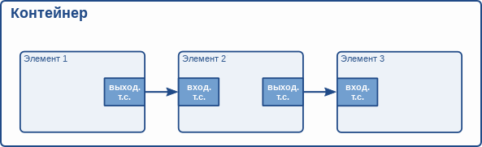

# Фреймворк GStreamer. Руководство разработчика приложений. Контейнеры [h1-bins]

Оригинал: GStreamer Application Development Manual  
Авторы: Wim Taymans, Steve Baker, Andy Wingo, Ronald S. Bultje, Stefan Kost  
Дата публикации: 21 мая 2014 г.  
Перевод: А.Панин  
Дата перевода: 19 июня 2014 г.  
Оригинал перевода: [Фреймворк GStreamer. Руководство разработчика приложений. Контейнеры](http://rus-linux.net/MyLDP/BOOKS/gstreamer/06-bins.html)

## Глава 6. Контейнеры [bins]

Контейнер является элементом, который может содержать другие элементы. Вы можете самостоятельно добавлять элементы в контейнер. Так как контейнер сам по себе является элементом, с ним можно работать точно так же, как и с другими элементами. Таким образом, вся информация из предыдущей главы (["Элементы"](05-elements.html)) может также использоваться при работе с контейнерами.

### 6.1. Чем являются контейнеры? [what-are-bins]

Контейнеры позволяют вам сформировать группу связанных элементов в рамках одного логического элемента. Вам больше не придется работать с отдельными элементами, а вместо них вы будете работать с единственным элементом, контейнером. Мы увидим, что данный подход является особенно мощным в том случае, если вы планируете создавать сложные контейнеры, так как он позволяет вам разделить конвейер на фрагменты меньшего размера.

Контейнер также будет управлять находящимися в нем элементами. Он осуществляет изменения состояний элементов наряду с накоплением и передачей сообщений, распространяемых посредством шины сообщений.



Существует единственный специализированный тип контейнера, доступный разработчику приложений на основе фреймворка GStreamer:

- Конвейер: контейнер общего назначения, который осуществляет синхронизацию работы элементов, а также управляет процессом передачи сообщений между ними. Контейнер верхнего уровня должен быть конвейером, поэтому каждое приложение должно иметь по крайней мере один контейнер.

### 6.2. Создание контейнера [creating-a-bin]

Контейнеры создаются таким же образом, как и другие элементы, т.е., с помощью фабрики элементов. Для этих целей также существуют вспомогательные функции (`gst_bin_new()` и `gst_pipeline_new()`). Для добавления элементов в контейнер или удаления элементов из контейнера вы можете использовать функции `gst_bin_add()` и `gst_bin_remove()`. Учтите, что контейнер, в который вы добавляете элемент, автоматически станет владельцем данного элемента. В том случае, если вы уничтожите контейнер, вместе с контейнером будет удалена ссылка на добавленный в него элемент. При удалении элемента из контейнера также будет произведено автоматическое удаление ссылки на элемент.

```
#include <gst/gst.h>

int
main (int   argc,
      char *argv[])
{
  GstElement *bin, *pipeline, *source, *sink;

  /* Инициализация */
  gst_init (&argc, &argv);

  /* Создание конвейера */
  pipeline = gst_pipeline_new ("my_pipeline");
  bin = gst_bin_new ("my_bin");
  source = gst_element_factory_make ("fakesrc", "source");
  sink = gst_element_factory_make ("fakesink", "sink");

  /* Первоочередное добавление элементов в контейнер */
  gst_bin_add_many (GST_BIN (bin), source, sink, NULL);
  /* Добавление контейнера в конвейер */
  gst_bin_add (GST_BIN (pipeline), bin);

  /* Связывание элементов */
  gst_element_link (source, sink);

[..]

}
```


Существуют различные функции для поиска элементов в контейнере. Наиболее часто используемыми функциями являются `gst_bin_get_by_name()` и `gst_bin_get_by_interface()`. Вы также можете осуществлять итерационный обход всех элементов из контейнера с помощью функции `gst_bin_iterate_elements()`. Обратитесь к описанию API класса [GstBin](http://gstreamer.freedesktop.org/data/doc/gstreamer/stable/gstreamer/html/GstBin.html) для получения более подробной информации.

### 6.3. Специализированные контейнеры [custom-bins]

Разработчик приложения может создавать собственные контейнеры, наполненные элементами для выполнения определенной задачи. Это позволит вам, к примеру, создать приложение для декодирования мультимедийных потоков формата Ogg/Vorbis исключительно с использованием следующих строк кода:

```
int
main (int   argc,
      char *argv[])
{
  GstElement *player;

  /* Инициализация */
  gst_init (&argc, &argv);

  /* Создание элемента проигрывателя потока */
  player = gst_element_factory_make ("oggvorbisplayer", "player");

  /* Передача имени аудиофайла для воспроизведения */
  g_object_set (player, "location", "helloworld.ogg", NULL);

  /* Начало воспроизведения */
  gst_element_set_state (GST_ELEMENT (player), GST_STATE_PLAYING);
[..]
}
```

(Конечно же, это не самый удачный пример, так как уже существуют более мощные и гибкие специализированные контейнеры, такие, как контейнер "playbin".)

Специализированные контейнеры могут быть созданы как на уровне плагинов, так и на уровне приложения. Вы сможете найти больше информации о создании специализированных контейнеров в [Руководстве разработчика плагинов ("Plugin Writers Guide")](http://gstreamer.freedesktop.org/data/doc/gstreamer/head/pwg/html/index.html).

Примерами таких специализированных контейнеров являются элементы playbin и uridecodebin из пакета [gst-plugins-base](http://gstreamer.freedesktop.org/data/doc/gstreamer/head/gst-plugins-base-plugins/html/index.html).

### 6.4. Контейнеры управляют состояниями своих дочерних элементов [bins-manage-states-of-their-children]

Контейнеры управляют состоянием элементов, которые в них содержатся. Если вы переводите контейнер (или конвейер, который является специальным типом контейнера верхнего уровня) в определенное состояние с помощью функции `gst_element_set_state()`, он позаботится о том, чтобы все содержащиеся в нем элементы также были переведены в это состояние. Это значит, что обычно необходимо всего лишь установить состояние конвейера верхнего уровня для запуска этого конвейера или его остановки.

Контейнер будет производить изменение состояния своих дочерних элементов начиная с элемента для вывода данных и заканчивая элементом для ввода данных. Такой подход позволяет быть уверенным в том, что элемент в конце конвейера будет готов к приему данных в момент, когда элемент в начале конвейера будет переведен в состояние "пауза" (PAUSED) или "проигрывается" (PLAYING). Аналогично при остановке конвейера элементы для вывода данных будут переведены в состояние "готовность к работе" (READY) или "отключено" (NULL) в первую очередь, что приведет к получению элементами в начале конвейера ошибки FLUSHING и остановке программных потоков для обработки мультимедийных потоков перед тем, как эти элементы также будут переведены в состояние "готовность к работе" (READY) или "отключено" (NULL).

Однако, следует учесть, что в том случае, если элементы добавляются в контейнер или в конвейер, который уже используется, т.е., в ходе обработки сигнала "pad-added", их состояние не будет автоматически приведено в соответствие с текущим состоянием или целевым состоянием контейнера или конвейера, в который они были добавлены. Вместо этого вам придется самостоятельно перевести элементы в требуемое целевое состояние с помощью функции `gst_element_set_state()` или `gst_element_sync_state_with_parent()` при добавлении их в уже работающий конвейер.

----------

Предыдущий раздел : [Элементы](05-elements.html)

Следующий раздел : [Шина сообщений](07-bus.html)

Главная страница : [http://neon1ks.github.io/](../index.html)
