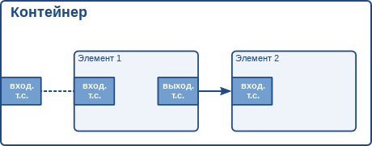

# Фреймворк GStreamer. Руководство разработчика приложений. Точки соединения и возможности [h1-pads-and-capabilities]

Оригинал: GStreamer Application Development Manual  
Авторы: Wim Taymans, Steve Baker, Andy Wingo, Ronald S. Bultje, Stefan Kost  
Дата публикации: 21 мая 2014 г.  
Перевод: А.Панин  
Дата перевода: 19 июня 2014 г.  
Оригинал перевода: [Фреймворк GStreamer. Руководство разработчика приложений. Точки соединения и возможности](http://rus-linux.net/MyLDP/BOOKS/gstreamer/08-pads.html)


## Глава 8. Точки соединения и возможности [pads-and-capabilities]

Как мы увидели в главе ["Элементы"](http://gstreamer.freedesktop.org/data/doc/gstreamer/head/manual/html/chapter-elements.html), точки соединения являются интерфейсом элемента для связи с внешним миром. Потоки данных от выходной точки соединения одного элемента передаются на входную точку соединения другого элемента. Специфичный тип мультимедийных данных, который элемент может обрабатывать, будет описываться с помощью возможностей точки соединения. Подробнее о возможностях мы поговорим позднее в данной главе (обратитесь к разделу под названием ["Возможности точки соединения"](http://rus-linux.net/MyLDP/BOOKS/gstreamer/08-pads.html#section-caps)).

### 8.1. Точки соединения [pads]

Тип точки соединения описывается с помощью двух свойств: ее направления и доступности. Как мы упоминали ранее, фреймворк GStreamer устанавливает два направления точек соединения: выходные точки соединения и входные точки соединения. Эта терминология была введена при рассмотрении ситуации на уровне элемента: элементы принимают данные с помощью своих входных точек соединения и генерируют данные для передачи с помощью своих выходных точек соединения. Схематично входные точки соединения изображаются в левой части элемента, а выходные точки соединения - в правой части элемента. На подобных схемах данные передаются слева направо[^1].

Понятие направления точек соединения является достаточно простым по сравнению с понятием их доступности. Точка соединения может быть в любом из следующих трех состояний доступности: всегда доступна, не постоянно доступна, доступна по запросу. Названия этих трех состояний говорят сами за себя: всегда доступные точки соединения доступны при любых обстоятельствах, не постоянно доступные точки соединения доступны лишь в определенных случаях (и могут становиться недоступными в произвольные моменты времени), а доступные по запросу точки соединения появляются только в случае явной отправки запросов со стороны приложений.

#### 8.1.1. Динамические (или не постоянно доступные) точки соединения [dynamic-or-sometimes-pads]

Некоторые элементы могут не иметь всех своих точек соединения в момент создания. Это может случиться, к примеру, при работе с элементом демультиплексора для мультимедийных потоков формата Ogg. Элемент будет читать мультимедийный поток формата Ogg и создавать динамические точки соединения для каждого содержащегося в этом потоке элементарного потока (vorbis, theora) при обнаружении такого потока в потоке данных формата Ogg. По аналогии точка соединения будет удаляться в момент окончания потока. Этот принцип очень полезен, например, для элементов демультиплексоров.

Выполнение команды gst-inspect oggdemux приведет к выводу информации о том, что элемент имеет всего лишь одну точку соединения: входную точку соединения под названием "sink". Все другие точки соединения являются "деактивированными". Вы можете убедиться в этом, рассмотрев описание шаблона точек соединения, а именно свойство, указывающее на не постоянную доступность точек соединения: "Availability: Sometimes". Точки соединения будут создаваться в зависимости от типа проигрываемого файла формата Ogg. Мы увидим, что эта особенность поведения приобретет особую важность тогда, когда вы пытаетесь создать динамические конвейеры. Вы можете установить обработчик сигналов для элемента с целью получения информации о создании средствами элемента новой точки соединения на основе одного из шаблонов не постоянно доступной точки соединения. Следующий фрагмент кода является примером выполнения описанного действия:

```
#include <gst/gst.h>

static void
cb_new_pad (GstElement *element,
	    GstPad     *pad,
	    gpointer    data)
{
  gchar *name;

  name = gst_pad_get_name (pad);
  g_print ("Новая точка соединения %s была создана\n", name);
  g_free (name);

  /* Здесь вы должны настроить соединение с созданной точкой соединения */
[..]

}

int 
main (int   argc,
      char *argv[]) 
{
  GstElement *pipeline, *source, *demux;
  GMainLoop *loop;

  /* Инициализация */
  gst_init (&argc, &argv);

  /* Создание элементов */
  pipeline = gst_pipeline_new ("my_pipeline");
  source = gst_element_factory_make ("filesrc", "source");
  g_object_set (source, "location", argv[1], NULL);
  demux = gst_element_factory_make ("oggdemux", "demuxer");

  /* При разработке реального приложения вам следует проверить, были ли успешно созданы элементы */

  /* Формирование конвейера */
  gst_bin_add_many (GST_BIN (pipeline), source, demux, NULL);
  gst_element_link_pads (source, "src", demux, "sink");

  /* Наблюдение за созданием точек соединения */
  g_signal_connect (demux, "pad-added", G_CALLBACK (cb_new_pad), NULL);

  /* Запуск конвейера */
  gst_element_set_state (GST_ELEMENT (pipeline), GST_STATE_PLAYING);
  loop = g_main_loop_new (NULL, FALSE);
  g_main_loop_run (loop);

[..]

}
```

Добавление элементов конвейера исключительно из обработчика сигнала создания точки соединения "pad-added" не является нестандартной практикой. В том случае, если вы поступаете подобным образом, вы не должны забывать об изменении состояния только что добавленных элементов на целевое состояние конвейера помощью функции `gst_element_set_state ()` или `gst_element_sync_state_with_parent ()`.

#### 8.1.2. Доступные по запросу точки соединения [request-pads]

Также элемент может иметь точки соединения, доступные по запросу. Эти точки соединения создаются не автоматически, а исключительно по запросу. Такое поведение очень полезно для элементов мультиплексирования, агрегации и деления. Элементы агрегации объединяют содержимое нескольких входных мультимедийных потоков в одни выходной мультимедийный поток. Элементы деления действуют строго наоборот: эти элементы принимают один входной мультимедийный поток и копируют этот поток для передачи посредством своих выходных точек соединения, которые создаются по запросу. В любой момент, когда приложению требуется еще одна копия потока, оно может просто запросить создание новой выходной точки соединения элемента деления.

Следующий фрагмент кода демонстрирует методику отправки запроса создания новой выходной точки соединения элемента деления:

```
static void
some_function (GstElement *tee)
{
  GstPad * pad;
  gchar *name;

  pad = gst_element_get_request_pad (tee, "src%d");
  name = gst_pad_get_name (pad);
  g_print ("Новая точка соединения %s была создана\n", name);
  g_free (name);

  /* Здесь вы должны осуществить связывание точки соединения элемента */
[..]

  /* и после этого удалить ссылку */
  gst_object_unref (GST_OBJECT (pad));
}
```

Метод `gst_element_get_request_pad ()` может использоваться для получения объекта точки соединения элемента на основе имени шаблона. Также имеется возможность запроса создания точки соединения, которая совместима с другим шаблоном. Это очень полезно в том случае, если вы хотите связать элемент с элементом мультиплексора и вам необходимо запросить создание совместимой точки соединения. Метод `gst_element_get_compatible_pad ()` может быть использован для запроса создания совместимой точки соединения таким образом, как показано в следующем примере. В нем осуществляется запрос создания совместимой точки соединения элемента мультиплексора формата Ogg от любого элемента для ввода данных.

```
static void
link_to_multiplexer (GstPad     *tolink_pad,
		     GstElement *mux)
{
  GstPad *pad;
  gchar *srcname, *sinkname;

  srcname = gst_pad_get_name (tolink_pad);
  pad = gst_element_get_compatible_pad (mux, tolink_pad);
  gst_pad_link (tolinkpad, pad);
  sinkname = gst_pad_get_name (pad);
  gst_object_unref (GST_OBJECT (pad));

  g_print ("Новая точка соединения %s была создана и связана с %s\n", srcname, sinkname);
  g_free (sinkname);
  g_free (srcname);
}
```

### 8.2. Возможности точки соединения [capabilities-of-a-pad]

Так как точки соединения играют чрезвычайно важную роль в представлении элемента внешнему миру, существует механизм на основе возможностей для описания того, какие данные могут передаваться или передаются в данный момент через точку соединения. В данном разделе мы кратко обсудим предназначение и методику использования возможностей в достаточной мере для понимания концепции. Для ознакомления с подробным обзором возможностей, а также списком всех возможностей, объявленных в рамках фреймворка GStreamer, следует обратиться к [Руководству разработчика плагинов ("Plugins Writers Guide")](http://gstreamer.freedesktop.org/data/doc/gstreamer/head/pwg/html/index.html).

Возможности ставятся в соответствие шаблонам точек соединения и самим точкам соединения. В случае шаблонов точек соединения они будут описывать типы мультимедийных данных, которые могут передаваться через точку соединения, созданную на основе данного шаблона. В случае точек соединения это может быть либо список доступных возможностей (обычно являющийся копией возможностей шаблона точки соединения), причем в этом случае точка соединения не должна быть использована, либо тип мультимедийных данных, которые в данный момент передаются через точку соединения, соответственно, в этом случае точка соединения должна использоваться.

#### 8.2.1. Исследование возможностей [dissecting-capabilities]

Возможности точки соединения описываются в рамках объекта типа `GstCaps`. На самом деле, объект типа [GstCaps](http://gstreamer.freedesktop.org/data/doc/gstreamer/stable/gstreamer/html/gstreamer-GstCaps.html) будет содержать одну или несколько структур типа [GstStructure](http://gstreamer.freedesktop.org/data/doc/gstreamer/stable/gstreamer/html/gstreamer-GstStructure.html), каждая из которых описывает один тип мультимедийных данных. Используемая точка соединения будет иметь набор возможностей, состоящий только из *одной* структуры. Также данная структура будет содержать только *фиксированные* значения. Эти ограничения не действительны в случае несвязанных точек соединения и шаблонов точек соединения.

В качестве примера ниже приведен дамп списка возможностей элемента "vorbisdec", который вы можете получить самостоятельно, выполнив команду **gst-inspect vorbisdec**. Вы увидите две точки соединения: выходную и входную. Обе эти точки соединения всегда доступны и имеют соответствующие списки возможностей. Входная точка соединения будет принимать аудиоданные, закодированные с помощью кодека vorbis и обозначаемые с помощью типа мультимедийных данных "audio/vorbis". Выходная точка соединения будет использоваться для передачи несжатых (декодированных) аудиосэмплов следующему элементу, принимающему декодированные аудиоданные (в нашем случае типа "audio/x-raw"). Эта выходная точка соединения также содержит набор свойств для указания скорости потока сэмплов и количества каналов в аудиопотоке, а также для хранения некоторых дополнительных данных, о которых вам не нужно беспокоиться на данный момент.

```
Pad Templates:
  SRC template: 'src'
    Availability: Always
    Capabilities:
      audio/x-raw
                 format: F32LE
                   rate: [ 1, 2147483647 ]
               channels: [ 1, 256 ]

  SINK template: 'sink'
    Availability: Always
    Capabilities:
      audio/x-vorbis
```

#### 8.2.2. Свойства и значения [properties-and-values]

Свойства используются для передачи дополнительной информации вместе с возможностями. Свойства состоят из ключа (в форме строки) и значения. Существует множество допустимых типов значений, которые могут использоваться:

- Базовые типы, которые могут быть зарегистрированы в Glib как типы `GType`. Соответствующие свойства содержат специфичные, не динамические значения. Примерами являются:

    - Целочисленные значения (`G_TYPE_INT`): свойство имеет заданное определенное значение.
    - Логические значения (`G_TYPE_BOOLEAN`): свойство имеет либо истинное значение TRUE, либо ложное значение FALSE.
    - Значения с плавающей точкой (`G_TYPE_FLOAT`): свойство имеет заданное определенное значение с плавающей точкой.
    - Строковые значения (`G_TYPE_STRING`): свойство содержит строку в кодировке UTF-8.
    - Дробное значение (`GST_TYPE_FRACTION`): содержит дробь, записанную в форме целочисленных числителя и знаменателя.
- Типы диапазонов являются типами `GType`, зарегистрированными фреймворком GStreamer для указания диапазона возможных значений. Они используются для указания допустимых значений частот дискретизации при работе с аудиопотоком или поддерживаемых размеров изображения при работе с видеопотоком. Тремя типами, объявленными в рамках фреймворка GStreamer, являются:

    - Диапазон целочисленных значений (`GST_TYPE_INT_RANGE`): свойство устанавливает диапазон возможных целочисленных значений с помощью значений верхней и нежней границы. Элемент "vorbisdec", например, имеет свойство "rate", значения которого могут находиться в диапазоне от 8000 до 50000.
    - Диапазон значений с плавающей точкой (`GST_TYPE_FLOAT_RANGE`): свойство устанавливает диапазон возможных значений с плавающей точкой с помощью значений верхней и нижней границы.
    - Диапазон дробных значений (`GST_TYPE_FRACTION_RANGE`): свойство устанавливает диапазон возможных дробных значений с помощью значений верхней и нижней границы.
- Список значений (`GST_TYPE_LIST`): свойство может принимать любое значение из списка приведенных базовых значений.
    
    Пример: возможности, используемые для указания на то, что поддерживается скорость дискретизации, равная либо 44100 Hz, либо 48000 Hz, должны использовать список целочисленных значений, первое значение в котором равно 44100, а второе - 48000.

- Массив значений (`GST_TYPE_ARRAY`): свойство является массивом значений. Каждый элемент массива сам по себе является полноценным значением. Все значения в массиве должны быть одного и того же элементарного типа. Это значит, что массив может содержать любую комбинацию целочисленных значений, списков целочисленных значений, диапазонов целочисленных значений, причем это же утверждение также справедливо для значений с плавающей точкой и списков, но при этом массив не может одновременно содержать значения с плавающей точкой и целочисленные значения. Пример: при наличии более чем двух каналов в аудиопотоке, распределение каналов должно быть четко задано (для аудипотоков с одним или двумя каналами используется стандартное распределение каналов, за исключением тех случаев, когда распределение каналов задается с помощью возможностей). Исходя из этого, распределение каналов может быть описано с помощью массива целочисленных значений из перечислений, где каждое значение из перечисления будет представлять позицию колонки. В отличие от типа `GST_TYPE_LIST`, значения в массиве будут интерпретироваться как единое целое.


### 8.3. Для чего используются возможности [what-capabilities-are-used-for]

Возможности (capabilities, сокр. caps) описывают тип данных, которые передаются между двумя точками соединения или поддерживаются рассматриваемой точкой соединения (шаблоном). Это обстоятельство делает их очень полезными для различных целей:

- Автоматическая подгрузка плагинов: автоматический поиск элементов для связывания точек соединения на основе их возможностей. Все элементы для автоматической подгрузки плагинов используют этот метод.

- Определение совместимости: при связывании двух точек соединения фреймворк GStreamer может установить, работают ли обе точки соединения с одним и тем же типом мультимедийных данных. Процесс связывания двух точек соединения и проверки их совместимости называется "согласованием возможностей".

- Метаданные: читая возможности точки соединения, приложения могут предоставить информацию о типе передаваемых через точку соединения мультимедийных данных, причем эта информация будет относиться к проигрываемому в данный момент потоку.

- Фильтрация: приложение может использовать возможности для ограничения множества возможных типов мультимедийных данных, которые могут передаваться между двумя точками соединения, до определенного подмножества поддерживаемых типов потоков. Приложение может, например, использовать "отфильтрованные возможности" для установки определенного (фиксированного или не фиксированного) размера изображения для потока, передаваемого между двумя точками соединения. Вы увидите пример использования механизма фильтрации возможностей позднее в данном руководстве в разделе под названием ["Добавление или удаление данных при работе с конвейером в ручном режиме"](http://gstreamer.freedesktop.org/data/doc/gstreamer/head/manual/html/section-data-spoof.html). Вы можете осуществить фильтрацию возможностей, добавив элемент фильтра возможностей в ваш конвейер и установив значение его свойства "caps". Фильтры возможностей обычно размещаются после таких элементов преобразования, как "audioconvert", "audioresample", "videoconvert" или "videosacale" для того, чтобы указать данным элементам преобразования потока на необходимость преобразования данных в заданный выходной формат в определенной точке потока.


#### 8.3.1. Использование возможностей для работы с метаданными [using-capabilities-for-metadata]

Точка соединения может иметь набор (т.е. одну или более) соответствующих возможностей. Возможности (типа `GstCaps`) представлены в виде массива из одной или нескольких структур типа `GstStructure`, а каждая структура типа `GstStructure` является массивом полей, где каждое поле состоит из имени (например, "width") и типизированного значения (например, значения типа `G_TYPE_INT` или `GST_TYPE_INT_RANGE`).

Учтите, что существует строгое разделение между вероятными (*possible*) возможностями (т.е., теми возможностями шаблонов точек соединения, которые показаны в выводе утилиты gst-inspect), допустимыми (*allowed*) возможностями (которые могут совпадать с возможностями шаблона точки соединения или быть подмножеством этих возможностей в зависимости от вероятных возможностей связанной точки соединения) и согласованными возможностями (*negotiated*) точки соединения (эти возможности описывают текущий формат потока или буфера, содержат только одну структуру и не имеют таких изменяемых данных, как диапазоны или списки, т.е., являются фиксированными возможностями).

Вы можете получить значения свойств из набора возможностей, извлекая отдельные свойства определенной структуры. При работе с объектом возможностей саму структуру вы можете получить с помощью функции `gst_caps_get_structure ()`, а количество структур в объекте возможностей типа `GstCaps` - с помощью функции `gst_caps_get_size ()`.

Возможности называются простыми возможностями (`simple caps`) в том случае ,если они содержат только одну структуру и фиксированными возможностями (`fixed caps`) в том случае, если они содержат только одну структуру и не имеют полей изменяемых типов (таких, как диапазоны или списки допустимых значений). Два других специальных типа возможностей называются произвольными возможностями (`ANY caps`) и пустыми возможностями (`empty caps`).

Ниже приведен пример методики извлечения значений ширины и высоты видео из набора фиксированных возможностей:

```
static void
read_video_props (GstCaps *caps)
{
  gint width, height;
  const GstStructure *str;

  g_return_if_fail (gst_caps_is_fixed (caps));

  str = gst_caps_get_structure (caps, 0);
  if (!gst_structure_get_int (str, "width", &width) ||
      !gst_structure_get_int (str, "height", &height)) {
    g_print ("Значения ширины и высоты недоступны\n");
    return;
  }

  g_print ("Размеры видео из данного набора возможностей: %dx%d\n",
	   width, height);
}
```

#### 8.3.2. Создание возможностей для фильтрации [creating-capabilities-for-filtering]

Хотя возможности по большей части используются в рамках плагинов для описания типов мультимедийных потоков, которые могут передаваться через точки соединения, разработчик приложения обычно также должен иметь базовые представления о реализации механизма возможностей для того, чтобы осуществлять взаимодействие с плагинами, особенно при использовании механизма фильтрации возможностей. Если вы используете механизмы фильтрации или фиксации возможностей, вы ограничиваете множество допустимых для передачи между двумя точками соединения типов мультимедийных потоков подмножеством поддерживаемых ими типов мультимедийных потоков. Вы можете ввести это ограничение, использовав элемент `capsfilter` в составе вашего контейнера. Для этого вам также придется создать ваш собственный объект возможностей типа `GstCaps`. Простейшим способом создания этого объекта является использование вспомогательной функции `gst_caps_new_simple ()`:

```
static gboolean
link_elements_with_filter (GstElement *element1, GstElement *element2)
{
  gboolean link_ok;
  GstCaps *caps;

  caps = gst_caps_new_simple ("video/x-raw",
  	      "format", G_TYPE_STRING, "I420",
	      "width", G_TYPE_INT, 384,
	      "height", G_TYPE_INT, 288,
	      "framerate", GST_TYPE_FRACTION, 25, 1,
	      NULL);

  link_ok = gst_element_link_filtered (element1, element2, caps);
  gst_caps_unref (caps);

  if (!link_ok) {
    g_warning ("Не удалось связать элемент 1 (element1) с элементом 2 (element2) !");
  }

  return link_ok;
}
```

Эта операция приведет к принудительному использованию определенного формата видеопотока, ширины, высоты и частоты кадров для передачи данных между этими двумя элементами (или связывание окончится неудачей в том случае, если описанные параметры не могут использоваться в контексте рассматриваемых элементов). Помните о том, что при использовании функции `gst_element_link_filtered ()` будет автоматически создан элемент `capsfilter`, который будет помещен в ваш контейнер или в ваш конвейер между теми двумя элементами, которые вы хотите соединить (это важно в том случае, если вы захотите разъединить эти элементы, так как вам вместо этого придется отсоединять оба элемента от элемента фильтра возможностей `capsfilter`).

В некоторых случаях вы можете отдать предпочтение созданию более сложного набора возможностей для фильтрации данных, передаваемых между двумя точками соединения. Описанная функция может оказаться слишком простой для этой цели и вам придется использовать метод `gst_caps_new_full ()`:

```
static gboolean
link_elements_with_filter (GstElement *element1, GstElement *element2)
{
  gboolean link_ok;
  GstCaps *caps;

  caps = gst_caps_new_full (
      gst_structure_new ("video/x-raw",
			 "width", G_TYPE_INT, 384,
			 "height", G_TYPE_INT, 288,
			 "framerate", GST_TYPE_FRACTION, 25, 1,
			 NULL),
      gst_structure_new ("video/x-bayer",
			 "width", G_TYPE_INT, 384,
			 "height", G_TYPE_INT, 288,
			 "framerate", GST_TYPE_FRACTION, 25, 1,
			 NULL),
      NULL);

  link_ok = gst_element_link_filtered (element1, element2, caps);
  gst_caps_unref (caps);

  if (!link_ok) {
    g_warning ("Не удалось связать элемент 1 (element1) с элементом 2 (element2) !");
  }

  return link_ok;
}
```

Обратитесь к документации API для ознакомления с полными описаниями API объектов типа [GstStructure](http://gstreamer.freedesktop.org/data/doc/gstreamer/stable/gstreamer/html/gstreamer-GstStructure.html) и [GstCaps](http://gstreamer.freedesktop.org/data/doc/gstreamer/stable/gstreamer/html/gstreamer-GstCaps.html).

### 8.4. Виртуальные точки соединения [ghost-pads]

На Рисунке 8.1, "Изображение элемента контейнера без виртуальных точек соединения" вы можете увидеть, что контейнер не имеет собственных точек соединения. В данном случае в игру вступают "виртуальные точки соединения".


Виртуальная точка соединения является точкой соединения какого-либо элемента из контейнера, к которой также можно получить доступ напрямую через контейнер. Можете считать ее аналогом символьной ссылки в файловых системах ОС UNIX. При использовании виртуальных точек соединения в контейнерах сам контейнер также будет иметь точку соединения и сможет прозрачно использоваться как и любой элемент, объявленный в других частях вашего кода.



Рисунок 8.2. "Изображение элемента контейнера с виртуальной точкой соединения" иллюстрирует виртуальную точку соединения. Входная точка соединения первого элемента теперь используется также в качестве точки соединения контейнера. Так как виртуальные точки соединения выглядят и работают точно так же, как и любые другие точки соединения, они могут добавляться в элементы любых типов, а не только в контейнеры типа `GstBin`, точно таким же образом, как и обычные точки соединения.

Виртуальная точка соединения создается с помощью функции `gst_ghost_pad_new ()`:

```
#include <gst/gst.h>

int
main (int   argc,
      char *argv[])
{
  GstElement *bin, *sink;
  GstPad *pad;

  /* Инициализация */
  gst_init (&argc, &argv);

  /* Создание элемента, добавление в контейнер */
  sink = gst_element_factory_make ("fakesink", "sink");
  bin = gst_bin_new ("mybin");
  gst_bin_add (GST_BIN (bin), sink);

  /* Добавление виртуальной точки соединения */
  pad = gst_element_get_static_pad (sink, "sink");
  gst_element_add_pad (bin, gst_ghost_pad_new ("sink", pad));
  gst_object_unref (GST_OBJECT (pad));

[..]

}
```

В примере выше контейнер также имеет точку соединения: используется входная точка соединения с именем "sink" заданного элемента. Теперь контейнер может использоваться в качестве замены элемента для вывода данных. При этом вы также можете, к примеру, связать другой элемент с данным контейнером.

----------

Предыдущий раздел : [Шина сообщений](07-bus.html)

Следующий раздел : [Буферы и события](09-data.html)

Главная страница : [http://neon1ks.github.io/](../index.html)


[^1]: В реальности не существует препятствия для передачи данных от выходной точки соединения к входной точке соединения одного и того же элемента в противоположном конвейеру направлении (влево по отношению к текущему элементу на рисунке). Данные, однако, всегда передаются от выходной точки соединения одного элемента к входной точке соединения другого.
