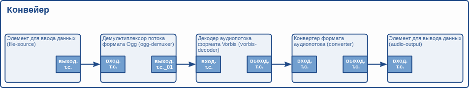

# Фреймворк GStreamer. Руководство разработчика приложений. Ваше первое приложение [h1-your-first-application]

Оригинал: GStreamer Application Development Manual  
Авторы: Wim Taymans, Steve Baker, Andy Wingo, Ronald S. Bultje, Stefan Kost  
Дата публикации: 21 мая 2014 г.  
Перевод: А.Панин  
Дата перевода: 19 июня 2014 г.  
Оригинал перевода: [Фреймворк GStreamer. Руководство разработчика приложений. Ваше первое приложение](http://rus-linux.net/MyLDP/BOOKS/gstreamer/10-helloworld.html)


## Глава 10. Ваше первое приложение [your-first-application]

В данной главе мы обобщим всю информация из предыдущих глав. В ней освещены все аспекты создания простого приложения на основе фреймворка GStreamer, включая инициализацию библиотек, создание элементов, упаковку элементов с целью формирования конвейера и проигрывание мультимедийного потока с помощью этого конвейера. Выполнив эти действия, вы сможете создать простой проигрыватель аудиофайлов формата Ogg/Vorbis.

### 10.1. Hello world [hello-world]

Мы будем создавать первое простое приложение, являющееся проигрывателем для аудиофайлов формата Ogg/Vorbis с интерфейсом командной строки. Для этого мы будем использовать стандартные компоненты фреймворка GStreamer. Проигрыватель будет читать файл, заданный с помощью параметра командной строки. Давайте начинать работу!

В Главе 4, [Главе 4, "Инициализация библиотеки фреймворка GStreamer"](http://gstreamer.freedesktop.org/data/doc/gstreamer/head/manual/html/chapter-init.html) мы узнали о том, что первой операцией, которую необходимо выполнить с помощью вашего приложения, является инициализация библиотеки фреймворка GStreamer, которая осуществляется путем вызова функции `gst_init ()`. Также следует убедиться в том, что к исходному коду приложения подключен заголовочный файл `gst/gst.h`, который содержит необходимые объявления всех имен функций и объектов. Используйте директиву `#include <gst/gst.h>` для подключения этого файла.

После этого вы захотите создать различные элементы с помощью функции `gst_element_factory_make ()`. Для реализации проигрывателя аудиофайлов формата Ogg/Vorbis нам потребуется элемент для ввода данных, который будет читать данные с диска. Фреймворк GStreamer включает элемент с описанными функциями и именем "filesrc". Далее, нам потребуются какие-либо элементы для разбора файла, а также его декодирования с целью получения раскодированного аудиопотока. Для этой цели в составе фреймворка GStreamer имеются два элемента: первый элемент позволяет осуществить разбор потока формата Ogg на элементарные потоки (аудио- и видеопотоки) и носит имя "oggdemux". Второй элемент является декодером аудиопотока формата Vorbis и, соответственно, назван "vorbisdec". Так как элемент "oggdemux" создает динамические точки соединения для каждого элементарного потока, вам придется устанавливать обработчик сигнала добавления точки соединения "pad-added" для элемента "oggdemux" таким же образом, как описано в разделе под названием ["Динамические (или не постоянно доступные) точки соединения"](http://gstreamer.freedesktop.org/data/doc/gstreamer/head/manual/html/chapter-pads.html#section-pads-dynamic) для того, чтобы связать элемент демультиплексора потока формата Ogg с элементом декодера аудиопотока формата Vorbis. Наконец, нам также потребуется элемент для вывода аудиоданных, в качестве которого мы используем элемент с именем "autoaudiosink", который автоматически определит звуковое устройство.

Последняя операция, которую нам стоит выполнить, заключается в добавлении всех элементов в контейнерный элемент типа `GstPipeline` и ожидании завершения проигрывания всей композиции. Ранее мы узнали о том, как как добавлять элементы в контейнерный элемент в [Главе 6, "Контейнеры"](http://gstreamer.freedesktop.org/data/doc/gstreamer/head/manual/html/chapter-bins.html), а также о состояниях элементов в [разделе под названием "Состояния элементов"](http://gstreamer.freedesktop.org/data/doc/gstreamer/head/manual/html/section-elements-states.html). Кроме того, мы также установим обработчик сообщений конвейера для того, чтобы получать уведомления об ошибках и определять момент окончания потока. 

А теперь давайте объединим все наши размышления в форме кода для того, чтобы получить наш первый проигрыватель аудиофайлов:

```
#include <gst/gst.h>
#include <glib.h>


static gboolean
bus_call (GstBus     *bus,
          GstMessage *msg,
          gpointer    data)
{
  GMainLoop *loop = (GMainLoop *) data;

  switch (GST_MESSAGE_TYPE (msg)) {

    case GST_MESSAGE_EOS:
      g_print ("Окончание потока\n");
      g_main_loop_quit (loop);
      break;

    case GST_MESSAGE_ERROR: {
      gchar  *debug;
      GError *error;

      gst_message_parse_error (msg, &error, &debug);
      g_free (debug);

      g_printerr ("Ошибка: %s\n", error->message);
      g_error_free (error);

      g_main_loop_quit (loop);
      break;
    }
    default:
      break;
  }

  return TRUE;
}


static void
on_pad_added (GstElement *element,
              GstPad     *pad,
              gpointer    data)
{
  GstPad *sinkpad;
  GstElement *decoder = (GstElement *) data;

  /* Теперь мы можем связать эту точку соединения с входной точкой соединения элемента декодирования аудиопотока формата vorbis */
  g_print ("Динамическая точка соединения создана и связывает демультиплексор с декодером\n");

  sinkpad = gst_element_get_static_pad (decoder, "sink");

  gst_pad_link (pad, sinkpad);

  gst_object_unref (sinkpad);
}


int
main (int   argc,
      char *argv[])
{
  GMainLoop *loop;

  GstElement *pipeline, *source, *demuxer, *decoder, *conv, *sink;
  GstBus *bus;
  guint bus_watch_id;

  /* Инициализация */
  gst_init (&argc, &argv);

  loop = g_main_loop_new (NULL, FALSE);


  /* Проверка входных аргументов */
  if (argc != 2) {
    g_printerr ("Использование: %s <имя файла формата Ogg/Vorbis>\n", argv[0]);
    return -1;
  }


  /* Создание элементов из состава фреймворка GStreamer */
  pipeline = gst_pipeline_new ("audio-player");
  source   = gst_element_factory_make ("filesrc",       "file-source");
  demuxer  = gst_element_factory_make ("oggdemux",      "ogg-demuxer");
  decoder  = gst_element_factory_make ("vorbisdec",     "vorbis-decoder");
  conv     = gst_element_factory_make ("audioconvert",  "converter");
  sink     = gst_element_factory_make ("autoaudiosink", "audio-output");

  if (!pipeline || !source || !demuxer || !decoder || !conv || !sink) {
    g_printerr ("Не удалось создать один из элементов конвейера. Работа приложения завершена.\n");
    return -1;
  }

  /* Настройка конвейера */

  /* Передаем заданное имя аудиофайла элементу для ввода данных  */
  g_object_set (G_OBJECT (source), "location", argv[1], NULL);

  /* Устанавливаем обработчик сообщений */
  bus = gst_pipeline_get_bus (GST_PIPELINE (pipeline));
  bus_watch_id = gst_bus_add_watch (bus, bus_call, loop);
  gst_object_unref (bus);

  /* Добавляем все элементы в конвейер */
  /* file-source | ogg-demuxer | vorbis-decoder | converter | alsa-output */
  gst_bin_add_many (GST_BIN (pipeline),
                    source, demuxer, decoder, conv, sink, NULL);

  /* Связываем элементы друг с другом */
  /* file-source -> ogg-demuxer ~> vorbis-decoder -> converter -> alsa-output */
  gst_element_link (source, demuxer);
  gst_element_link_many (decoder, conv, sink, NULL);
  g_signal_connect (demuxer, "pad-added", G_CALLBACK (on_pad_added), decoder);

  /* Помните о том, что демультиплексор будет связываться с декодером динамически.
     Это происходит из-за того, что поток формата Ogg может содержать различные потоки 
     (например, аудио-  и видеопотоки). Выходные точки соединения будут создаваться 
     демультиплексором в процессе работы приложения по мере определения количества и
     и типа элементарных потоков. Исходя из этого, мы устанавливаем функцию обратного
     вызова, которая будет вызвана в момент генерации сигнала "pad-added".*/


  /* Перевод конвейера в состояние "проигрывается"*/
  g_print ("В данный момент проигрывается: %s\n", argv[1]);
  gst_element_set_state (pipeline, GST_STATE_PLAYING);


  /* Итерация */
  g_print ("Приложение выполняется...\n");
  g_main_loop_run (loop);


  /* Выход из главного цикла обработки событий, аккуратное освобождение ресурсов */
  g_print ("Завершение работы приложения, окончание воспроизведения\n");
  gst_element_set_state (pipeline, GST_STATE_NULL);

  g_print ("Уничтожение конвейера\n");
  gst_object_unref (GST_OBJECT (pipeline));
  g_source_remove (bus_watch_id);
  g_main_loop_unref (loop);

  return 0;
}
```

Мы создали завершенный конвейер. Теперь мы можем схематично изобразить его следующим образом:



### 10.2. Компиляция файла helloworld.c и запуск приложения [compiling-and-running-helloworldc]

Для компиляции примера "helloworld" следует использовать команду: `gcc -Wall helloworld.c -o helloworld $(pkg-config --cflags --libs gstreamer-1.0)`. Фреймворк GStreamer использует инструмент **pkg-config** для получения флагов компилятора и линковщика, необходимых для компиляции данного приложения.

В том случае, если вы используете нестандартную установку (т.е., вы самостоятельно скомпилировали исходный код и установили библиотеки фреймворка GStreamer вместо того, чтобы использовать предварительно собранные пакеты), убедитесь в том, что переменная окружения `PKG_CONFIG_PATH` указывает на корректную директорию (`$libdir/pkgconfig`).

В маловероятном случае использования не устанавливаемой версии фреймворка GStreamer (т.е., gst-uninstalled), вам придется использовать инструмент libtool для выполнения сборки программы helloworld с помощью аналогичной команды: `libtool --mode=link gcc -Wall helloworld.c -o helloworld $(pkg-config --cflags --libs gstreamer-1.0)`.

Вы можете запустить приложение, собранное на основе кода из данного примера, воспользовавшись командой `./helloworld file.ogg`. Замените `file.ogg` на имя файла формата Ogg/Vorbis с вашей любимой композицией.

### 10.3. Заключение [conclusion]

Настало время для заключительных пояснений относительно нашего примера. Как вы видите, создание конвейера является очень низкоуровневой, но мощной операцией. В следующих частях руководства вы познакомитесь с методикой создания более мощного мультимедийного проигрывателя, требующей меньше усилий благодаря использованию более высокоуровневых интерфейсов. Обо всем этом мы поговорим в [Части IV, "Высокоуровневые интерфейсы для приложений на основе фреймворка GStreamer"](http://gstreamer.freedesktop.org/data/doc/gstreamer/head/manual/html/part-highlevel.html). Однако, сначала мы подробнее обсудим более сложные внутренние механизмы фреймворка GStreamer.

При рассмотрении примера должно быть ясно то, что мы можем достаточно просто заменить элемент с именем "filesrc" на какой-либо другой элемент, который будет принимать данные посредством сети или другой элемент ввода данных, который будет лучше интегрирован с вашим окружением рабочего стола. Вы также можете использовать другие декодеры и элементы разбора потоков/демультиплексоры для добавления поддержки мультимедийных потоков других типов. К тому же, вы можете использовать другой элемент вывода аудиопотока в том случае, если вы используете не Linux, а Mac OS X, Windows или FreeBSD, причем вместо него вы можете использовать элемент вывода данных для записи аудиопотоков в файлы на диске вместо их воспроизведения. Используя элемент для ввода данных, работающий с аудиокартой, вы можете даже захватывать аудиопоток вместо его проигрывания. Все эти примеры свидетельствуют о наличии возможности повторного использования элементов фреймворка GStreamer, которая является его значительным преимуществом.

----------

Предыдущий раздел : [Буферы и события](09-data.html)

Следующий раздел : Отслеживание позиции в перемещение в мультимедийном потоке.

Главная страница : [http://neon1ks.github.io/](../index.html)


