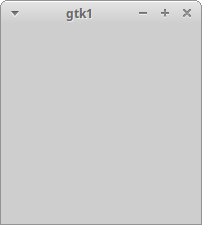

# Введение в GTK+ [introducing-gtk]

Теперь, когда вы познакомились с системой X Window System, самое время рассмотреть комплект инструментальных средств GTK+ Toolkit. GTK+ появился на свет как часть популярного графического редактора GNU Image Manipulation Program (GIMP), от которого он и унаследовал свое имя (The Gimp ToolKit). Очевидно, что программисты GIMP всерьез предвидели превращение GTK+ в самостоятельный проект, поскольку он вырос и стал один из самых мощных и популярных комплектов инструментов. Домашнюю страницу проекта GTK+ можно найти по адресу [https://www.gtk.org/](https://www.gtk.org/).

> *Примечание*
>
> В итоге, GTK+ &mdash; это библиотека, которая существенно упрощает создание графических интерфейсов пользователя (Graphical User Interface, GUI), предоставляя набор готовых компонентов, именуемых *виджетами* которые вы соединяете вместе с помощью легких в использовании вызовов функций, включенных в логическую структуру вашего приложения

Несмотря на то, что GTK+ &mdash; это проект GNU, как и GIMP, он выпущен на условиях более либеральной лицензии (Lesser General Public License, Стандартная общественная лицензия ограниченного применения GNU), которая освобождает программное обеспечение (включая патентованное программное обеспечение с закрытым программным кодом), написанное с использованием GTK+, от уплаты лицензионных вознаграждений или авторских гонораров, а также других ограничений.

Комплект GTK+ целиком написан на языке C и большая часть программного обеспечения GTK+ также написана на C. К счастью, существует ряд привязок к языкам (linguage binding), позволяющих применять GTK+ в предпочитаемом вами языке программирования, будь то C++, Python, PHP, Ruby, Perl, C# или Java.

Комплект GTK+ сформирован как надстройка для ряда других библиотек. К ним относятся следующие:

- GLib &mdash; предоставляет низкоуровневые структуры данных, типы, поддержку потоков, циклов событий и динамической загрузки;

- GObject &mdash; реализует объектно-ориентированную систему на языке C, не требующую применения языка C++;

- Pango &mdash; поддерживает визуализацию и форматирование текста;

- ATK &mdash; помогает создавать приложения с доступом и возволяет пользователям запускать ваши приложения с помощью средств чтения экрана и других средств доступа;

- GDK (GIMP Drawing Kit) &mdash; обрабатывает визуализацию низкоуровневой графики поверх библиотеки Xlib;

- GdkPixbuf &mdash; помогает манипулировать изображениями в программах GTK+;

- Cairo &mdash; библиотека для отрисовки векторной графики;

- Xlib &mdash; предоставляет низкоуровневую графику в системах Linux и Unix.


## Система типов Glib [glib-type-system]

Если вы когда-нибудь просматривали программный код GTK+, то могли удивиться, увидев множество типов данных языка C с префиксом `g`, например, `gint`, `gchar`, `gshort`, а также незнакомые типы `gint32` и `gpointer`. Дело в том, что комплект GTK+ основан на библиотеках переносимости языка C (portability libraries), названных GLib и GObject, которые определяют эти типы для того, чтобы способствовать межплатформным разработкам.

GLib и GObject помогают межплатформным разработкам, обеспечивая стандартный набор типов данных замещения, функций и макросов для поддержки управления памятью и общих задач. Эти типы, функции и макросы означают, что, как программисты GTK+, мы можем быть уверены в том, что наш программный код надежно переносится на другие платформы и архитектуры.

В библиотеке GLib также определено несколько очень удобных констант:

```
#include <glib/gmacros.h>

#define FALSE 0
#define TRUE !FALSE
```

Дополнительные типы данных &mdash; это типы, служащие заменой для стандартных типов данных C (из соображений совместимости и читабельности) и гарантирующий одинаковый размер в байтах на всех платформах:

- `gint`, `guint`, `gchar`, `guchar`, `glong`, `gulong`, `gfloat` и `gdouble` &mdash; просто замены для стандартных типов C для совместимости;

- `gpointer` &mdash; синоним типа `(void *)`;

- `gboolean` &mdash; полезен для представления логических значений и служит оболочкой для `int`;

- `gint8`, `guint8`, `gint16`, `guint16`, `gint32` и `guint32` &mdash; знаковые и беззнаковые типы с гарантированным размером в байтах.


Удобно то, что применение библиотек GLib и GObject почти прозрачно. GLib широко используется в GTK+, поэтому если у вас есть работающая установка GTK+, то вы обнаружите, что библиотека Glib уже установлена. Как вы увидите позже в этой главе, при программировании с помощью комплекта GTK+ вам даже не придется явно включать заголовочный файл `glib.h`.


## Система объектов GTK+ [gtk-object-system]

Все, у кого уже есть опыт программирования GUI, возможно, поймут наше утверждение о строгой приверженности библиотек GUI концепции объектно-ориентированного программирования (ООП), настолько строгой, что все современные комплекты инструментов, включая GTK+, написаны в стиле объектно-ориентированного программирования.

Несмотря на то, что комплект инструментов GTK+ написан на чистом C, он поддерживает объекты и ООП благодаря библиотеке GObject. Эта библиотека поддерживает наследование объектов и полиморфизм с помощью макросов.

Давайте рассмотрим образец наследования и полиморфизма на примере иерархии объектов `GtkWindow`, взятой из документации GTK+ API.

<pre>GObject
╰── GInitiallyUnowned
    ╰── GtkWidget
        ╰── GtkContainer
            ╰── GtkBin
                ╰── GtkWindow
</pre>

Этот список объектов говорит о том, что объект `GtkWindow` &mdash; потомок `GtkBin`, и, следовательно, любую функцию , которую вы вызываете с объектом `GtkBin`, вы можете вызвать и с объектом `GtkWindow`. Точно так же объект `GtkWindow` наследует из объекта `GtkContainer`, который в свою очередь наследует из объекта `GtkWidget`.

Для удобства все функции создания виджетов возвращают тип `GtkWidget`. Например,

<pre>GtkWidget *gtk_window_new (GtkWindowType type);
</pre>

Предположим, что вы создаете объект `GtkWindow` и хотите передать возвращенное значение в функцию, ожидающую объект типа `GtkContainer`, например, такую, как `gtk_container_add`:

<pre>void gtk_container_add (GtkContainer *container, GtkWidget *widget);
</pre>

Вы применяете макрос `GTK_CONTAINER` для приведения типов `GtkWidget` и `GtkContainer`:

<pre>GtkWidget *window = gtk_window_new (GTK_WINDOW_TOPLEVEL);
gtk_container_add (GTK_CONTAINER (window), awidget);
</pre>

Назначение этих функций вы узнаете позже; сейчас просто отметьте для себя частое применение макросов. Для каждого возможного приведения типа существует макрос.

> *Примечание*
>
> Не беспокойтесь, если вам всё это не очень понятно; вам не нужно разбираться в подробностях ООП для того, чтобы освоить GNOME/GTK+. На самом деле это безболезненный способ усвоить идеи и преимущества ООП на базе знакомого вам языка C.


## Знакомство с GNOME [introducing-gnome]

GNOME &mdash; имя, данное проекту, начатому в 1997 г. программистами, работавшими в проекте GNU Image Manipulation Program (GIMP) над созданием унифицированного рабочего стола для Linux. Все были согласны с тем, что выбор ОС Linux как платформы рабочего стола тормозился отсутствием согласованной стратегии. В то время рабочий стол Linux напоминал Дикий Запад без общих стандартов или выработанных на практике приемов, и программисты могли делать всё, что вздумается. Без свободной группы, контролирующей меню рабочего стола, согласованное представление и отображение, документацию, трансляцию и т. д., освоение рабочего стола новичком было в лучшем случае путанным, а в худшем &mdash; непригодным.

Группа GNOME намеривалась создать рабочий стол для ОС Linux с лицензией GPL, разрабатывая утилиты и программы настройки в едином согласованном стиле, одновременно способствуя развитию стандартов для взаимодействия приложений, печати, управления сеансами и лучших приёмов в программировании GUI приложений.

Результаты их стараний очевидны: среда GNOME &mdash; основа стандартного рабочего стола Linux в дистрибутивах Debian, Fedora, Red Hat, Ubuntu и др. (рис. 1).


Первоначально название GNOME означало GNU Network Object Model Environment (среда сетевых объектных моделей GNU), что отражает одну из ранее поставленных задач, внедрение в систему Linux объектной интегрированной системы, такой как Microsoft OLE, для того, чтобы вы могли, например, встроить электронную таблицу в документ текстового процессора. Теперь поставлены новые задачи, и то, что сегодня нам известно как GNOME, &mdash; это законченная вреда рабочего стола, содержащая панель для запуска приложений, комплект программ и утилит, библиотеки программирования и средства поддержки разработчиков.

Перед тем как начать программировать, следует убедиться в том, что все необходимые библиотеки установлены.

## Установка библиотек разработки GTK+ [installing-gtk-development-libraries]

В этой главе вы будете работать с GTK+ 3, поэтому убедитесь в том, что установлены библиотеки версии `3.x`.

В дистрибутиве Debian и основанных на Debian системах, таких как Ubuntu, вы можете использовать программу `apt` (или `apt-get`) для установки пакетов GTK+ с разных сайтов-зеркал (mirrors). Так для установки библиотек разработки GTK+ будет команда:

<pre>sudo apt install libgtk-3-dev
</pre>

Опробуйте также демонстрационное приложение GTK+ &mdash; `gtk3-demo`, в котором показаны практически все виджеты и их оформление (рис. 2). Установить `gtk3-demo` можно командой:

<pre>sudo apt install gtk-3-examples
</pre>


> *Примечание*
>
> Для каждого виджета отображаются вкладки **Info** (Информация) и **Source** (Исходный код). На вкладке **Source** приведен программный код на языке C для применения данного виджета. На ней может быть представлено множество примеров.


### Пример: Обычное окно GtkWindow [example-a-plain-gtkwindow]

Давайте начнем программирование средствами GTK+ с простейшей из программ GUI &mdash; отображения окна. Вы увидите библиотеку GTK+ в действии и большой набор функциональных возможностей, получаемых из очень короткого программного кода.

Введите программу и назовите её `gtk1.c`:

```C
#include <gtk/gtk.h>

int main(int argc, char *argv[])
{
    GtkWidget *window;

    gtk_init(&argc, &argv);
    window = gtk_window_new(GTK_WINDOW_TOPLEVEL);
    gtk_widget_show(window);
    gtk_main();

    return 0;
}
```
Для компиляции `gtk1.c` введите следующую команду:

```
gcc gtk1.c -o gtk1 `pkg-config --cflags --libs gtk+-3.0`
```

> *Примечание*
>
> Будьте внимательны и набирайте обратные апострофы, а не обычные апострофы &mdash; помните о том, что обратные апострофы &mdash; это инструкции, заставляющие оболочку выполнить заключенную в них команду и добавить ее вывод в конец строки.


Когда вы выполните программу с помощью следующей команды, ваше окно должно раскрыться (рис. 3).

<pre>./gtk1
</pre>



Учтите, что вы можете перемещать окно, изменять его размер, сворачивать и раскрывать его на весь экран.

#### Как это работает [how-it-works]

Включить заголовочные файлы, необходимые для библиотек GTK+ и связанных с ними библиотек, можно с помощью одного оператора ``#include <gtk/gtk.h>``. Далее вы объявляете окно как указатель на объект `GtkWidget`.

Затем для инициализации библиотек GTK+ следует выполнить вызов `gtk_init`, передав аргументы командной строки `argc` и `argv`. Это дает возможность GTK+ выполнить синтаксический анализ любых параметров командной строки, о которых комплект должен знать. Учтите, что вы всегда должны инициализировать GTK+ таким способом перед вызовом любых функций GTK+.

Суть примера заключается в вызове функции `gtk_window_new`. Далее приведен ее прототип:

```C
GtkWidget *gtk_window_new (GtkWindowType type);
```

Параметр `type` может принимать в зависимости от назначения окна одно из двух значений:

- `GTK_WINDOW_TOPLEVEL` &mdash; стандартное окно с рамкой;

- `GTK_WINDOW_POPUP` &mdash; окно без рамки, подходящее для диалогового окна.

Почти всегда вы будете применять значение `GTK_WINDOW_TOPLEVEL`, потому что для создания диалоговых окон, как вы узнаете позже, есть гораздо более удобные способы.

Вызов `gtk_window_new` создает окна в памяти, таким образом у вас появляется возможность перед реальным выводом окна на экран заполнить его виджетами, изменить размер окна, его заголовок и т. д. Для того чтобы окно появилось на экране, выполните вызов функции `gtk_widget_show`:

```C
gtk_widget_show(window);
```

Эта функция принимает указатель типа `GtkWidget`, поэтому вы просто предоставляете ссылку на свое окно.

Последним вы выполняете вызов функции `gtk_main`. Эта основная функция запускает процесс обмена информацией (interactivity process), передавая управление GTK+, и не возвращает его до тех пор, пока не будет выполнен вызов функции `gtk_main_quit`. Как видно в программе `gtk1.c`, этого никогда не происходит, поэтому приложение не завершается даже после закрытия окна. Проверьте это, щелкнув кнопкой мыши пиктограмму закрытия окна и убедившись в отсутствии строки приглашающей вводить команду. Вы исправите это поведение после того, как познакомитесь с сигналами и обратными вызовами в следующем разделе. Сейчас завершите приложение, нажав комбинацию клавиш `<Ctrl>+<C>` в окне командной оболочки, которое вы использовали для запуска программы gtk1.


----------

Назад: [Введение в систему X](01-introducing-x.html).

Далее: [События, сигналы и обратные вызовы](03-events-signals-and-callbacks.html)

Вернуться  [на главную страницу](../../index.html).