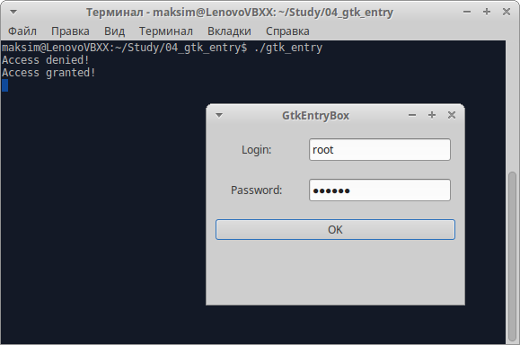

# Виджеты GTK+ [widgets-gtk]

В этом разделе мы рассмотрим API самых популярных виджетов GTK+, которые вы будете применять чаще всего в своих приложениях.

## GtkWindow [gtkwindow]

`GtkWindow` &mdash; базовый элемент всех приложений GTK+. До сих пор вы использовали его для хранения своих виджетов.

```nohighlight
GObject
╰── GInitiallyUnowned
    ╰── GtkWidget
        ╰── GtkContainer
            ╰── GtkBin
                ╰── GtkWindow
```

Существуют десятки вызовов API `GtkWindow`, но далее приведены функции, заслуживающие особого внимания.

```C
GtkWidget *gtk_window_new (GtkWindowType type);
void gtk_window_set_title (GtkWindow *window, const gchar *title);
void gtk_window_set_position (GtkWindow *window, GtkWindowPosition position);
void gtk_window_set_default_size (GtkWindow *window, gint width, gint height);
void gtk_window_resize (GtkWindow *window, gint width, gint height);
void gtk_window_set_resizable (GtkWindow *window, gboolean resizable);
void gtk_window_present (GtkWindow *window);
void gtk_window_maximize (GtkWindow *window);
void gtk_window_unmaximize (GtkWindow *window);
```

Как вы видели, функция `gtk_window_new` создаёт в памяти новое пустое окно. Заголовок окна не задан и местоположение окна не определены. Обычно вы будете заполнять окно виджетами и задавать меню и панель инструментов перед выводом окна на экран с помощью вызова функции `gtk_widget_show`.

Функция `gtk_window_set_title` изменяет текст полосы заголовка, информируя оконный менеджер запроса.

> *Примечание*
>
> Поскольку за отображение оформления окна отвечает оконный менеджер, а не библиотека GTK+, шрифт, цвет и размер текста зависят от вашего выбора оконного менеджера.

Функция `gtk_window_set_position` управляет начальным местоположением на экране. Параметр `position` может принимать пять значений, перечисленных в табл. 1.

<table class="table">
<caption>Таблица 1.</caption>
<colgroup>
<col class="col-md-4">
<col class="col-md-8">
</colgroup>
<thead>
<tr>
<th>Параметр <code>position</code></th>
<th>Описание</th>
</tr>
</thead>
<tbody>
<tr>
<td><code>GTK_WIN_POS_NONE</code></td>
<td>Окно располагается по усмотрению оконного менеджера</td>
</tr>
<tr>
<td><code>GTK_WIN_POS_CENTER</code></td>
<td>Окно центрируется на экране</td>
</tr>
<tr>
<td><code>GTK_WIN_POS_MOUSE</code></td>
<td>Расположение окна задается указателем мыши</td>
</tr>
<tr>
<td><code>GTK_WIN_POS_CENTER_ALWAYS</code></td>
<td>Окно остаётся отцентрированным независимо от его размера</td>
</tr>
<tr>
<td><code>GTK_WIN_POS_CENTER_ON_PARENT</code></td>
<td>Окно центрируется относительно родительского окна (удобно для диалоговых окон)</td>
</tr>
</tbody>
</table>

Функция `gtk_window_set_default_size` задаёт окно на экране в единицах отображения GTK+. Явное задание размера окна гарантирует, что содержимое окна не будет закрыто чем-либо или скрыто. Для того чтобы изменить размеры окна после его вывода на экран, можно воспользоваться функцией `gtk_window_resize`. По умолчанию пользователь может изменить размер окна, перемещая обычным способом его границу мышью. Если вы хотите помешать этому, можно вызвать функцию `gtk_window_set_resizable`, приравненную `FALSE`.

Для того чтобы убедиться в том, что ваше окно присутствует на экране и видно пользователю, т.е. не свернуто или скрыто, подойдет функция `gtk_window_present`. Она полезна для диалоговых окон, т.е. позволяет убедиться в том, что она не свернуты, когда вам нужен какой-либо пользовательский ввод. В противном случае, для раскрытия окна на весь экран и его сворачивания у вас есть функции `gtk_window_maximize` и `gtk_window_unmaximize`.


## GtkEntry [gtkentry]

`GtkEntry` &mdash; виджет однострочного текстового поля, который обычно применяется для ввода простых текстовых данных, например, адреса электронной почты, имени пользователя или имени узла сети. Существуют вызовы API, позволяющие задать как считывание введенного текста, так и его максимальную длину в символах, а также другие параметры, управляющие местоположением текста и его выделением.

```nohighlight
GObject
╰── GInitiallyUnowned
    ╰── GtkWidget
        ╰── GtkEntry
```

Можно настроить `GtkEntry` на отображение звёздочек (или любого другого определенного пользователем символа) на месте набранных буквенно-цифровых символов, что очень удобно для ввода паролей, когда вы не хотите, чтобы кто-то заглядывал через ваше плечо и читал текст.

Мы опишем большинство самых полезных функций виджета `GtkEntry`:

```
GtkWidget *gtk_entry_new (void);
void gtk_entry_set_max_length (GtkEntry *entry, gint max);
const gchar *gtk_entry_get_text (GtkEntry *entry);
void gtk_entry_set_text (GtkEntry *entry, const gchar *text);
void gtk_entry_set_visibility (GtkEntry *entry, gboolean visible);
void gtk_entry_set_invisible_char (GtkEntry *entry, gunichar ch);
```

Вы можете создавать `GtkEntry` с помощью функции `gtk_entry_new`. Функцией `gtk_entry_set_max_length` можно настроить ввод текста фиксированной длины. Ограничение ввода определенной длинной текста избавит вас от проверки корректности длины ввода и, возможно, необходимости информировать пользователя о том, что текст слишком длинный.

Для получения содержимого виджета `GtkEntry` вызывайте функцию `gtk_entry_get_text`, которая возвращает указатель `const gchar`, внутренний по отношению к `GtkEntry`. Если вы хотите изменить текст или передать его в функцию, которая может его модифицировать, следует скомпилировать строку с помощью, например, функции `strcpy`.

Вы можете вручную задать содержимое виджета `GtkEntry`, применив функцию `gtk_entry_set_text`. Учтите, что она принимает указатель `const gchar`.

### Пример: ввод имени пользователя и пароля

Теперь, познакомившись с функциями виджета `GtkEntry`, посмотрим на них в действии в небольшой программе. Программа `gtk_entry.c` будет создавать окно ввода имени пользователя и пароля и сравнивать введенный пароль с секретным.

<ol>
<li>
<p>Сначанала определим секретный пароль, остроумно заданный как <code>secret</code>:</p>
<pre><code class="C">#include &lt;gtk/gtk.h&gt;
#include &lt;stdio.h&gt;
#include &lt;string.h&gt;

const char *password = &quot;secret&quot;;
</code></pre>
</li>
<li>
<p>У вас есть две функции обратно вызова, которые вызываются, когда уничтожается окно и щелкатеся мышью кнопка "OK":</p>
<pre><code>void closeApp(GtkWidget *window, gpointer data)
{
    gtk_main_quit();
}

void button_clicked(GtkWidget *button, gpoвinter data)
{
    const char *password_text = gtk_entry_get_text(GTK_ENTRY((GtkWidget *)data));

    if (strcmp(password_text, password) == 0)
        printf(&quot;Access granted!\n&quot;);
    else
        printf(&quot;Access denied!\n&quot;);
}
</code></pre>
</li>
<li>
<p>В функции <code>main</code> создаётся, компонуется интерфейс и связываются обратные вызовы с сигналами. Для компоновки виджетов меток и полей ввода примените виджеты-контейнеры <code>GtkBox</code>:</p>
<pre><code>int main(int argc, char *argv[])
{
    GtkWidget *window;
    GtkWidget *username_label, *password_label;
    GtkWidget *username_entry, *password_entry;
    GtkWidget *ok_button;
    GtkWidget *hbox1, *hbox2;
    GtkWidget *vbox;

    gtk_init(&amp;argc, &amp;argv);

    window = gtk_window_new(GTK_WINDOW_TOPLEVEL);
    gtk_window_set_title(GTK_WINDOW(window), &quot;GtkEntryBox&quot;);
    gtk_window_set_position(GTK_WINDOW(window), GTK_WIN_POS_CENTER);
    gtk_window_set_default_size(GTK_WINDOW(window), 200, 200);
    gtk_container_set_border_width(GTK_CONTAINER(window), 10);

    g_signal_connect(G_OBJECT(window), &quot;destroy&quot;, G_CALLBACK(closeApp), NULL);

    username_label = gtk_label_new(&quot;Login: &quot;);
    password_label = gtk_label_new(&quot;Password: &quot;);

    gtk_label_set_width_chars(GTK_LABEL(username_label), 12);
    gtk_label_set_width_chars(GTK_LABEL(password_label), 12);

    username_entry = gtk_entry_new();
    password_entry = gtk_entry_new();
    gtk_entry_set_visibility(GTK_ENTRY(password_entry), FALSE);

    ok_button = gtk_button_new_with_label(&quot;OK&quot;);

    g_signal_connect(G_OBJECT(ok_button), &quot;clicked&quot;, G_CALLBACK(button_clicked), password_entry);

    hbox1 = gtk_box_new(GTK_ORIENTATION_HORIZONTAL, 5);
    hbox2 = gtk_box_new(GTK_ORIENTATION_HORIZONTAL, 5);

    vbox = gtk_box_new(GTK_ORIENTATION_VERTICAL, 10);

    gtk_box_pack_start(GTK_BOX(hbox1), username_label, TRUE, FALSE, 5);
    gtk_box_pack_start(GTK_BOX(hbox1), username_entry, TRUE, FALSE, 5);

    gtk_box_pack_start(GTK_BOX(hbox2), password_label, TRUE, FALSE, 5);
    gtk_box_pack_start(GTK_BOX(hbox2), password_entry, TRUE, FALSE, 5);

    gtk_box_pack_start(GTK_BOX(vbox), hbox1, FALSE, FALSE, 5);
    gtk_box_pack_start(GTK_BOX(vbox), hbox2, FALSE, FALSE, 5);
    gtk_box_pack_start(GTK_BOX(vbox), ok_button, FALSE, FALSE, 5);

    gtk_container_add(GTK_CONTAINER(window), vbox);

    gtk_widget_show_all(window);

    gtk_main();

    return 0;
}
</code></pre>
</li>
</ol>

Когда вы запустите программу, то получите окно, показанное на рис. 1.




