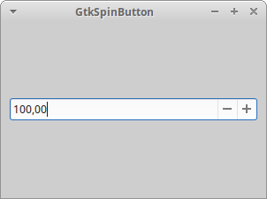

# GtkSpinButton [gtkspinbutton]

Порой вам нужно, чтобы пользователь ввел числовое значение, например, максимальную скорость или размер инструмента, и в такой ситуации виджет `GtkSpinButton` (кнопка-счетчик) идеален. Он ограничивает ввод пользователя только цифровыми символами и можно задать диапазон допустимых значений от нижней до верхней границы. Виджет также содержит кнопки, плюс и минус, так что пользователь может "накручивать" значение, для удобства пользуясь только мышью.

```nohighlight
GObject
╰── GInitiallyUnowned
    ╰── GtkWidget
        ╰── GtkEntry
            ╰── GtkSpinButton
```

И снова API понятен, и мы перечислим наиболее часто применяемые вызовы:

```C
GtkWidget *gtk_spin_button_new              (GtkAdjustment *adjustment, gdouble climb_rate, guint digits);
GtkWidget *gtk_spin_button_new_with_range   (gdouble min, gdouble max, gdouble step);
void       gtk_spin_button_set_digits       (GtkSpinButton *spin_button, guint digits);
void       gtk_spin_button_set_increments   (GtkSpinButton *spin_button, gdouble step, gdouble page);
void       gtk_spin_button_set_range        (GtkSpinButton *spin_button, gdouble min, gdouble max);
gdouble    gtk_spin_button_get_value        (GtkSpinButton *spin_button);
gint       gtk_spin_button_get_value_as_int (GtkSpinButton *spin_button);
void       gtk_spin_button_set_value        (GtkSpinButton *spin_button, gdouble value);
```

Для создания виджета типа `GtkSpinButton` с помощью функции `gtk_spin_button_new()` вы сначала должны создать объект `GtkAdjustment`. Виджет `GtkAdjustment` &mdash; это абстрактный объект содержащий логику, касающуюся управления значениями с ограничениями. Он также применяется и в других виджетах, например, `GtkScale`.

Для создания объекта типа `GtkAdjustment` передайте в функцию нижнюю и верхнюю границы и размер приращения.

```
GtkAdjustment *
gtk_adjustment_new (gdouble value,          // Начальное значение
                    gdouble lower,          // Минимальное значение
                    gdouble upper,          // Максимальное значение
                    gdouble step_increment, // Шаг приращения
                    gdouble page_increment, // Страничное приращение
                    gdouble page_size);     // Размер страницы
```

Значения параметров `step_increment` и `page_increment` задают величину минимального и максимального приращений. В случае кнопки-счетчика `GtkSpinButton` параметр `step_increment` определяет, насколько изменится значение при щелчке мышью по кнопкам виджета. Параметры `page_increment` и `page_size` в виджетах `GtkSpinButton` не важны.

Второй параметр, `climb_rate`, в функции `gtk_spin_button_new()` управляет скоростью прокрутки значений при нажатии и удерживании кнопки со стрелкой. И наконец, параметр `digits` задаёт точность представления числового значения виджета, если, например, `digits` равен 2, кнопка-счетчик отобразит `0.00`.

Функция `gtk_spin_button_new_with_range()` &mdash; удобный способ создания объекта `GtkSpinButton`. Просто задайте нижнюю и верхнюю границы и величину приращения.

Прочесть текущее значение очень легко благодаря функции `gtk_spin_button_get_value()`, а если вам нужно целое число, можно применить функцию `gtk_spin_button_get_value_as_int()`.

### Пример: использование виджета GtkSpinButton [example-use-gtkspinbutton]

Сейчас мы посмотрим в коротком примере, как действует кнопка-счётчик `GtkSpinButton`. Назовите файл `gtk_spin.c`.

```C
#include <gtk/gtk.h>

void closeApp(GtkWidget *window, gpointer data)
{
    gtk_main_quit();
}


int main(int argc, char *argv[])
{
    GtkWidget *window;
    GtkWidget *spinbutton;
    GtkAdjustment *adjustment;

    gtk_init(&argc, &argv);
    window = gtk_window_new(GTK_WINDOW_TOPLEVEL);
    gtk_window_set_title(GTK_WINDOW(window), "GtkSpinButton");
    gtk_window_set_position(GTK_WINDOW(window), GTK_WIN_POS_CENTER);
    gtk_window_set_default_size(GTK_WINDOW(window), 300, 200);
    gtk_container_set_border_width(GTK_CONTAINER(window), 10);

    g_signal_connect(G_OBJECT(window), "destroy", G_CALLBACK(closeApp), NULL);

    adjustment = gtk_adjustment_new(100.0, 50.0, 150.0, 0.5, 1.0, 1.0);
    spinbutton = gtk_spin_button_new(adjustment, 0.01, 2);

    gtk_container_add(GTK_CONTAINER(window), spinbutton);

    gtk_widget_show_all(window);

    gtk_main();

    return 0;
}
```

Когда вы выполните программу, по получите кнопку-счётчик, ограниченную диапазонов значений 50&ndash;150 (рис. 2).




----------

Назад: [Виджет GtkEntry](07-widgets-gtkentry.html)

Далее: [Виджеты класса GtkButton](09-widgets-gtkbutton.html)

Вернуться  [на главную страницу](../../index.html).