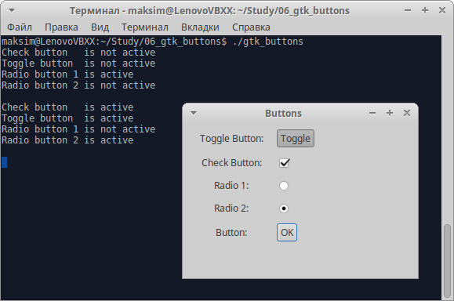

# GtkButton [gtkbutton]

Вы уже видели виджет кнопки `GtkButton` в действии, но существует несколько виджетов, потомков `GtkButton`, с чуть бо&#x301;льшими функциональными возможностями, заслуживающими упоминания.

```nohighlight
GObject
╰── GInitiallyUnowned
    ╰── GtkWidget
        ╰── GtkContainer
            ╰── GtkBin
                ╰── GtkButton
                    ╰── GtkToggleButton
                        ╰── GtkCheckButton
                            ╰── GtkRadioButton
```

Как видно из иерархии виджетов, кнопка-выключатель типа `GtkToggleButton` &mdash; прямой потомок кнопки `GtkButton`, кнопка-флажок `GtkCheckButton` &mdash; кнопки-выключателя `GtkToggleButton` и тоже самое для переключателя `GtkRadioButton`, причем каждый дочерний виджет предназначен для определенных задач.


## GtkToggleButton [gtktogglebutton]

Виджет `GtkToggleButton` идентичен виджету `GtkButton` за исключение одной важной детали: `GtkToggleButton` обладает *состоянием*. Это означает, что кнопка-выключатель может быть включена или выключена. Когда пользователь щелкает мышью виджет `GtkToggleButton`, последний стандартным способом порождает сигнал `clicked` и изменяет (или "Переключает") свое состояние.

API у виджета `GtkToggleButton` очень простой:

```C
GtkWidget *gtk_toggle_button_new            (void);
GtkWidget *gtk_toggle_button_new_with_label (const gchar *label);
gboolean   gtk_toggle_button_get_active     (GtkToggleButton *toggle_button);
void       gtk_toggle_button_set_active     (GtkToggleButton *toggle_button, gboolean is_active);
```

Наиболее интересные функции &mdash; `gtk_toggle_button_get_active` и `gtk_toggle_button_set_active`, которые вы вызываете для четния и установки состояния кнопки-выключателя. Если характеристика функционирования равна `TRUE`, это означает, что кнопка-выключатель `GtkToggleButton` включена.


## GtkCheckButton [gtkcheckbutton]

Кнопка-флажок &mdash; это замаскированная кнопка-выключатель `GtkToggleButton`. Вместо скучного прямоугольного отображения `GtkToggleButton` кнопка `GtkCheckButton` выводится как привлекательный флажок с расположенным рядом текстом. Функциональных различий между ними нет.

```C
GtkWidget *gtk_check_button_new            (void);
GtkWidget *gtk_check_button_new_with_label (const gchar *label);
```

## GtkRadioButton [gtkradiobutton]

Это кнопка немного отличается от предыдущих, т. к. может группироваться с другими кнопками того же типа. Переключатель (или радиокнопка) `GtkRadioButton` &mdash; одна из тех кнопок, которые позволяют выбирать только один вариант из группы предложенных. Имя заимствовано у старых радиоприёмников с механическими кнопками, которые выскакивали с треском, возвращаясь в прежнее состояние, при нажатии другой кнопки.

```C
GtkWidget *gtk_radio_button_new             (GSList *group);
GtkWidget *gtk_radio_button_new_from_widget (GtkRadioButton *radio_group_member);
GtkWidget *gtk_radio_button_new_with_label  (GSList *group, const gchar *label);
void       gtk_radio_button_set_group       (GtkRadioButton *radio_button, GSList *group);
GSList    *gtk_radio_button_get_group       (GtkRadioButton *radio_button);
```

Группа переключателей представлена в объекте-списке библиотеки GLib, названном `GSList`. Для того чтобы объединить переключатели в группу, вы можете создать объект `GSList` и затем передать ему каждую кнопку с помощью функций `gtk_radio_button_new` и `gtk_radio_button_get_group`. Есть и более легкий способ в виде функции `gtk_radio_button_new_from_widget()`, которая включает в GSList существующую кнопку. Вы увидете ее в действии в следующем примере, которое позволит вам опробовать разные кнопки `GtkButton`.

## Пример: использование кнопок GtkButton [example-use-gtk-buttons]

Введите следующий текст в файл с именем `gtk_buttons.c`.

1. Сначала объявите указатели на кнопки как глобальные переменные:

    ```C
    #include <gtk/gtk.h>
    #include <stdio.h>

    GtkWidget *togglebutton;
    GtkWidget *checkbutton;
    GtkWidget *radiobutton1, *radiobutton2;

    void closeApp(GtkWidget *window, gpointer data)
    {
        gtk_main_quit();
    }
    ```

2. Далее определите вспомогательную функцию, которая упаковывает `GtkWidget` и `GtkLabel` в контейнер `GtkBox` с горизонтальной ориентацией и затем вставляет этот `GtkBox` в заданный виджет-контейнер. Это поможет вам сократить повторяющийся программный код:

    ```C
    void add_widget_with_label(GtkContainer *box, gchar *caption, GtkWidget *widget)
    {
        GtkWidget *label = gtk_label_new(caption);
        GtkWidget *hbox = gtk_box_new(GTK_ORIENTATION_HORIZONTAL, 5);

        gtk_label_set_width_chars(GTK_LABEL(label), 15);

        gtk_container_add(GTK_CONTAINER(hbox), label);
        gtk_container_add(GTK_CONTAINER(hbox), widget);

        gtk_container_add(box, hbox);
    }
    ```

3. `print_active` — ещё одна вспомогательная функция, которая выводит текущее состояние заданной кнопки-выключателя `GtkToggleButton` со строкой описания. Он вызывается из функции `button_clicked`, функции обратного вызова, связанной с сигналом `clicked` кнопки "OK". При каждом щелчке мышью этой кнопки вы получаете на экране отчет о состоянии кнопок:

    ```C
    void print_active(char *button_name, GtkToggleButton *button)
    {
        gboolean active = gtk_toggle_button_get_active(button);

        printf("%s is %s\n", button_name, active ? "active" : "not active");
    }

    void button_clicked(GtkWidget *button, gpointer data)
    {
        print_active("Check button  ", GTK_TOGGLE_BUTTON(checkbutton));
        print_active("Toggle button ", GTK_TOGGLE_BUTTON(togglebutton));
        print_active("Radio button 1", GTK_TOGGLE_BUTTON(radiobutton1));
        print_active("Radio button 2", GTK_TOGGLE_BUTTON(radiobutton2));
        printf("\n");
    }
    ```

4. В функции `main` вы создаете виджеты кнопок, поочередно помещаете их в вертикальный контейнер GtkBox, добавив пояснительные метки, и связываете сигнал обратного вызова с кнопкой "OK":

    ```C
    int main(int argc, char *argv[])
    {
        GtkWidget *window;
        GtkWidget *button;
        GtkWidget *vbox;

        gtk_init(&argc, &argv);
        window = gtk_window_new(GTK_WINDOW_TOPLEVEL);
        gtk_window_set_title(GTK_WINDOW(window), "Buttons");
        gtk_window_set_position(GTK_WINDOW(window), GTK_WIN_POS_CENTER);
        gtk_window_set_default_size(GTK_WINDOW(window), 300, 200);
        gtk_container_set_border_width(GTK_CONTAINER(window), 10);

        g_signal_connect(G_OBJECT(window), "destroy", G_CALLBACK(closeApp), NULL);

        button = gtk_button_new_with_label("OK");
        togglebutton = gtk_toggle_button_new_with_label("Toggle");
        checkbutton = gtk_check_button_new();
        radiobutton1 = gtk_radio_button_new(NULL);
        radiobutton2 = gtk_radio_button_new_from_widget(GTK_RADIO_BUTTON(radiobutton1));

        vbox = gtk_box_new(GTK_ORIENTATION_VERTICAL, 10);

        add_widget_with_label(GTK_CONTAINER(vbox), "Toggle Button:", togglebutton);
        add_widget_with_label(GTK_CONTAINER(vbox), "Check Button:", checkbutton);
        add_widget_with_label(GTK_CONTAINER(vbox), "Radio 1:", radiobutton1);
        add_widget_with_label(GTK_CONTAINER(vbox), "Radio 2:", radiobutton2);
        add_widget_with_label(GTK_CONTAINER(vbox), "Button:", button);

        g_signal_connect(G_OBJECT(button), "clicked", G_CALLBACK(button_clicked), NULL);

        gtk_container_add(GTK_CONTAINER(window), vbox);

        gtk_widget_show_all(window);

        gtk_main();

        return 0;
    }
    ```


На рис. 3. показана программа `gtk_buttons.c` в действии с виджетами `GtkButton` четырех часто применяемых типов.



Щелкните мышью кнопку "OK", чтобы увидеть состояние разных кнопок.

Данная программа &mdash; простой пример использования кнопок `GtkButton` четырёх типов &mdash; показывает, как можно считать состояния кнопок типа `GtkToggleButton`, `GtkCheckButton` и `GtkRadioButton` с помощью единственной функции `gtk_toggle_button_get_active()`. Это одно из огромных преимуществ объектно-ориентированного подхода &mdash; поскольку вам не нужны отдельные функции `get_active()` для каждого типа кнопки, вы можете сократить требующийся программный код.


----------

Назад: [Виджет GtkSpinButton](08-widgets-gtkspinbutton.html)

Вернуться  [на главную страницу](../../index.html)

Далее: [Виджет GtkTreeView](10-widgets-gtktreeview.html)
